<!-- $size: A4 -portrait -->

  <h1 style="font-size: 18pt">1.2 Testsignal 100Hz</h1>
  
  
Pegel wird voll ausgelastet. In der Waveform ist zu sehen, dass es dennoch keine Abgeschnittenen Signale gibt.

  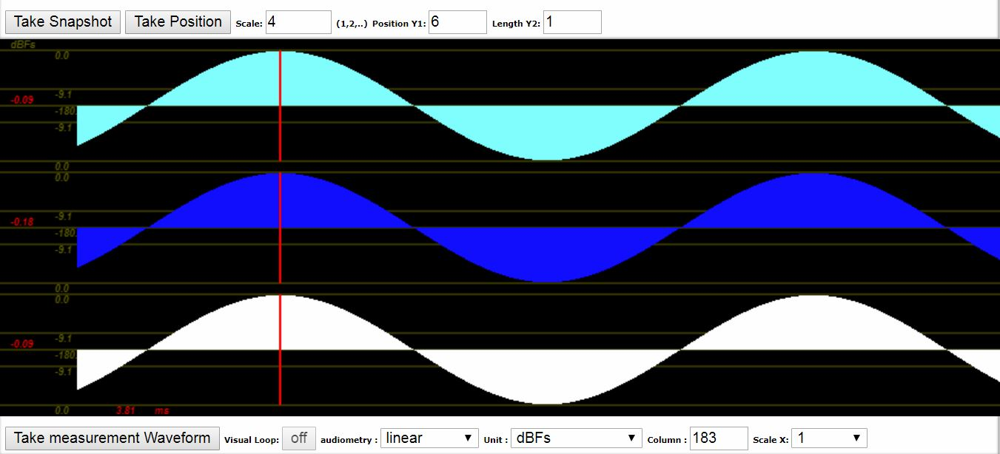
  
In der Waveform kann man den Sinus gut erkennen. 0DBFS ist erreicht worden.

  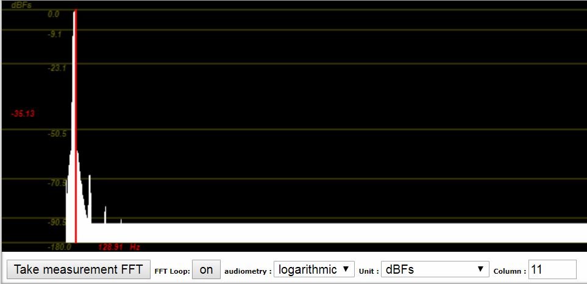
  
Es sind kaum Frequenzen aufgenommen worden.

  
Fazit: Das Signal hat eine gute Qualität.

---

  <h1 style="font-size: 18pt">1.2 Testsignal 1000Hz</h1>
  
  
Pegel wird voll ausgelastet. In der Waveform ist zu sehen, dass es dennoch keine Abgeschnittenen Signale gibt.

  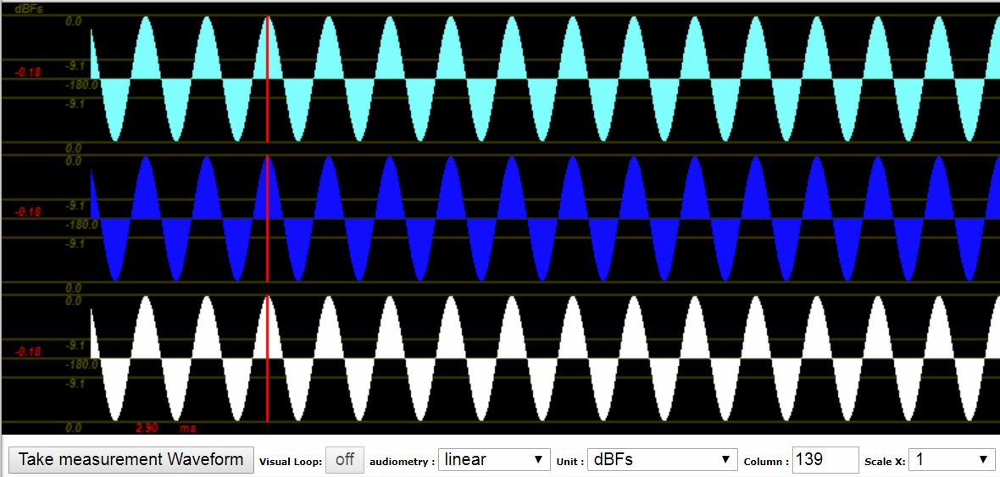
  
In der Waveform kann man den Sinus gut erkennen. 0DBFS ist erreicht worden.

  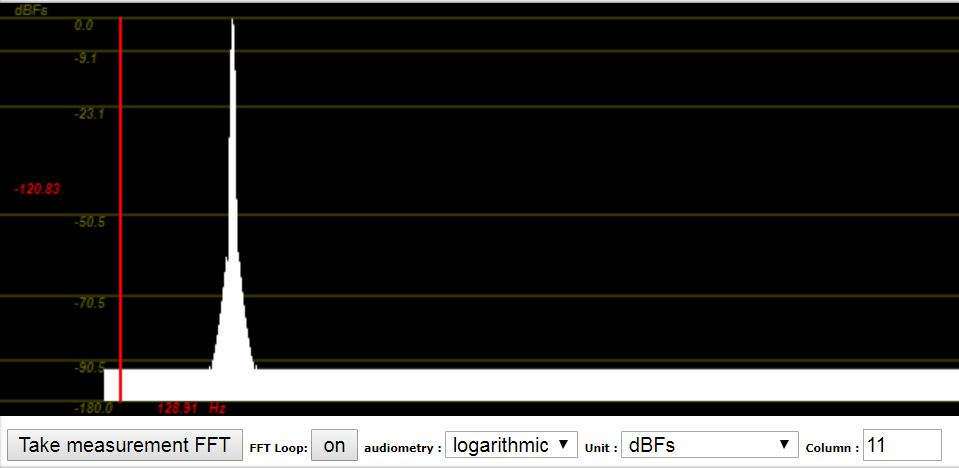
  
Es sind keine, bis verschwindend geringe andere Frequenzen aufgenommen worden.

  
Fazit: Das Signal hat eine sehr gute Qualität.

---

  <h1 style="font-size: 18pt">1.2 Testsignal 8000Hz</h1>
  
  
Pegel wird voll ausgelastet. In der Waveform ist zu sehen, dass es dennoch keine Abgeschnittenen Signale gibt.

  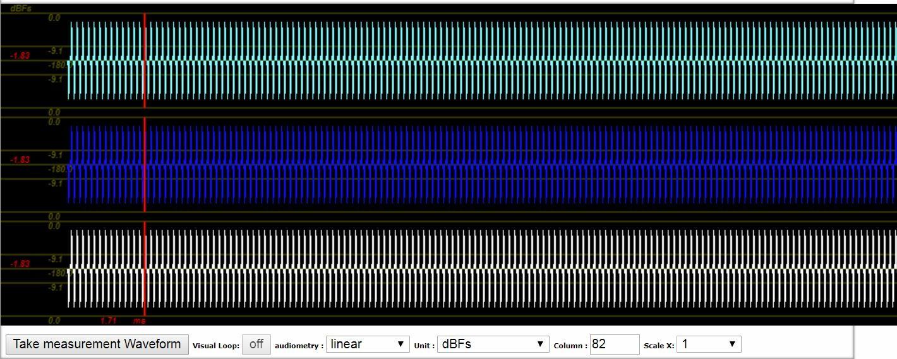
  
In der Waveform kann man den Sinus gut erkennen. 0DBFS ist erreicht worden.

  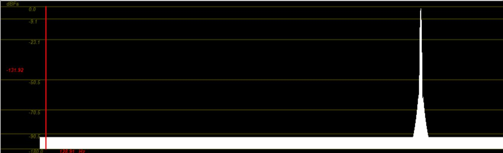
  
Es sind keine Frequenzen aufgenommen worden.

  
Fazit: Das Signal hat eine sehr gute Qualität.

---

  <h1 style="font-size: 18pt">1.2 Testsignal Stereo to Mono</h1>
  
  
Pegel wird fast voll ausgelastet.

  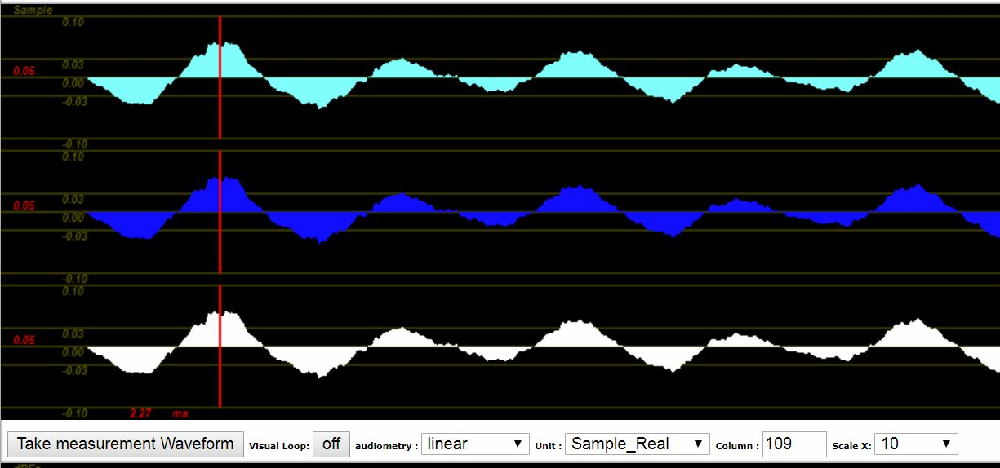
  
In der Waveform kann man den Sinus des Klavierspiels gut erkennen. 0DBFS ist nicht voll erreicht worden. Allerdings sind die Signale in Sinusform klar erkennbar

  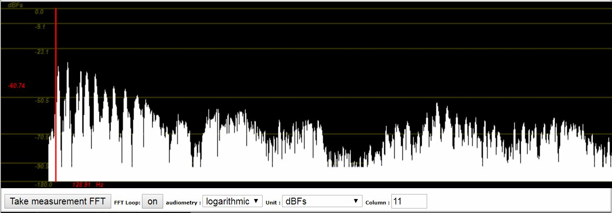
  
Das Klangspektrum ist klar erkennbar. Keine Frequenz wird abgeschnitten oder geht verloren.

  
Fazit: Das Signal hat eine mittlere bis gute Qualität.

---

  <h1 style="font-size: 18pt">1.3 Testsignal - Aufnahme 100Hz</h1>
  
  
Pegel wird voll ausgelastet.

  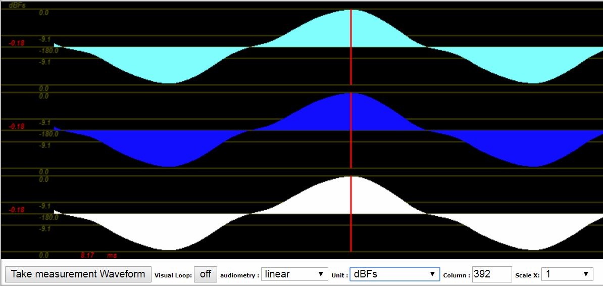
  
0DBFS ist fast voll erreicht worden. Die Sinuskurve ist klar erkennbar.

  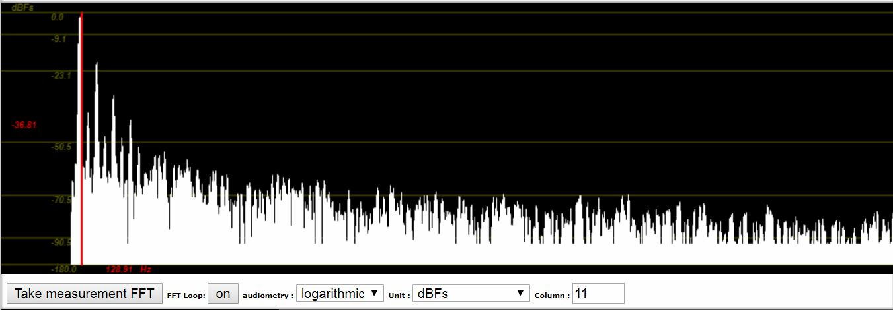
  

    Das Klangspektrum ist durch einige Stöhr-Frequenzen gespickt. Es ist jedoch klar zu erkennen, dass die am stärksten
    ausgepräkte Frequenz von 100Hz die Hauptverteilung ausmacht.
  

  
Fazit: Das Signal hat eine gute Qualität.

---

  <h1 style="font-size: 18pt">1.3 Gegenüberstellung/Vergleich - 100Hz - Waveform</h1>
  
Original

  
  
Aufnahme

    
  

    Die Sinuskurve ist im Original definierter und klarer. Der Sinus ist zwar in der Aufnahme noch klar und vollständig erkennbar, 		weißt jedoch Abeichungen auf.
  

---

  <h1 style="font-size: 18pt">1.3 Gegenüberstellung/Vergleich - 100Hz - Spektrum</h1>
  
Original

  
  
Aufnahme

    
  

    Das Original weißt wesentlich weinger fremde Frequenzen auf. In der Aufnahme ist ein leichtes "Rauschen" zu 		erkennen. Dennoch ist das Signal gut aufgenommen worden und hat eine mittlere bis gute Qualität.
  

---

  <h1 style="font-size: 18pt">1.3 Testsignal - Aufnahme 1000Hz</h1>
  
  
Pegel wird voll ausgelastet.

  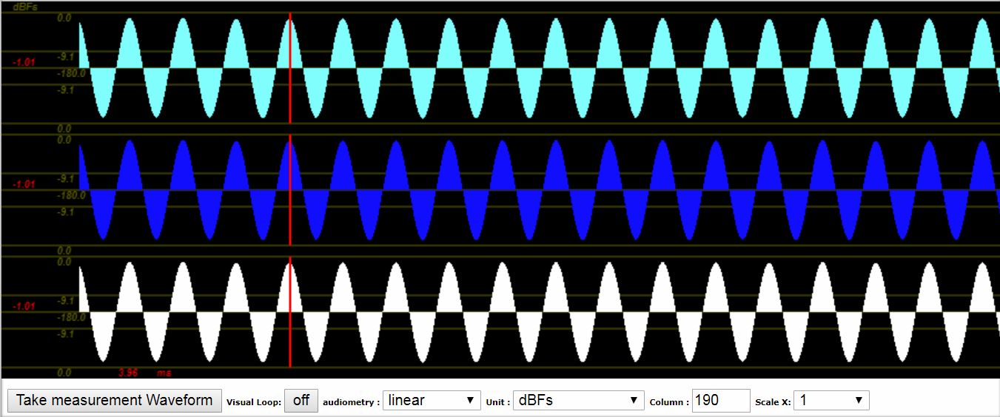
  
0DBFS ist fast voll erreicht worden. Die Sinuskurve ist klar erkennbar.

  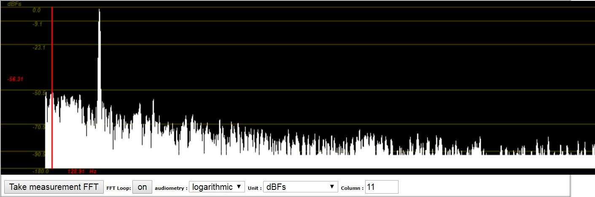
  

    Das Klangspektrum ist durch einige Stöhr-Frequenzen gespickt. Es ist jedoch klar zu erkennen, dass die am stärksten
    ausgepräkte Frequenz von 1000Hz die Hauptverteilung ausmacht.
  

  
Fazit: Das Signal hat eine gute bis sehr gute Qualität.

---

  <h1 style="font-size: 18pt">1.3 Gegenüberstellung/Vergleich - 1000Hz - Waveform</h1>
  
Original

  
  
Aufnahme

    
  

    Zwischen Original und Aufnahme ist kaum ein Unterschied auszumachen. Die Qualität der Aufnahme ist nahezu ohne 
    Verluste durchgeführt worden.
  

---

  <h1 style="font-size: 18pt">1.3 Gegenüberstellung/Vergleich - 1000Hz - Spektrum</h1>
  
Original

  
  
Aufnahme

    
  

    Das Original weißt wesentlich weinger fremde Frequenzen auf. In der Aufnahme ist ein leichtes "Rauschen" zu 		erkennen. Dennoch ist das Signal gut aufgenommen worden und hat eine sehr gute Qualität.
  

---

  <h1 style="font-size: 18pt">1.3 Testsignal - Aufnahme 8000Hz</h1>
  
  
Pegel wird voll ausgelastet.

  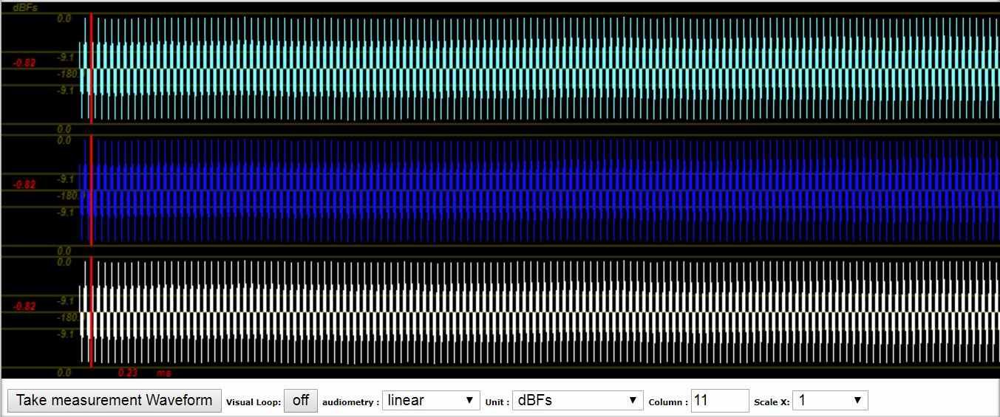
  
0DBFS ist fast voll erreicht worden. Die Sinuskurve ist klar erkennbar.

  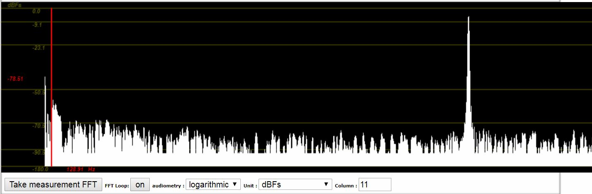
  

    Das Klangspektrum ist durch sehr wenige Stöhr-Frequenzen gespickt. Es ist jedoch klar zu erkennen, dass die am 	
    stärksten ausgepräkte Frequenz von 1000Hz die Hauptverteilung ausmacht.
  

  
Fazit: Das Signal hat eine sehr gute Qualität.

---

  <h1 style="font-size: 18pt">1.3 Gegenüberstellung/Vergleich - 8000Hz - Waveform</h1>
  
Original

  
  
Aufnahme

    
  

    Zwischen Original und Aufnahme ist kaum ein Unterschied auszumachen. Die Qualität der Aufnahme ist nahezu ohne 
    Verluste durchgeführt worden.
  

---

  <h1 style="font-size: 18pt">1.3 Gegenüberstellung/Vergleich - 8000Hz - Spektrum</h1>
  
Original

  
  
Aufnahme

    
  

    Das Original weißt wesentlich weinger fremde Frequenzen auf. In der Aufnahme ist ein leichtes "Rauschen" zu 		erkennen. Dennoch ist das Signal gut aufgenommen worden und hat eine sehr gute Qualität.
  

---

  <h1 style="font-size: 18pt">1.4 Aufnahme von Audiosignalen - Verkehrsgeräusche</h1>  
  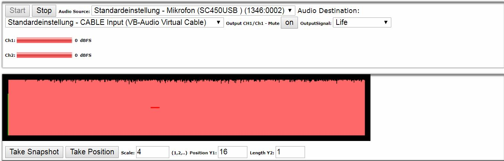
  
Es wurde eine fast vollständige Pegel-Auslastung erreicht.

  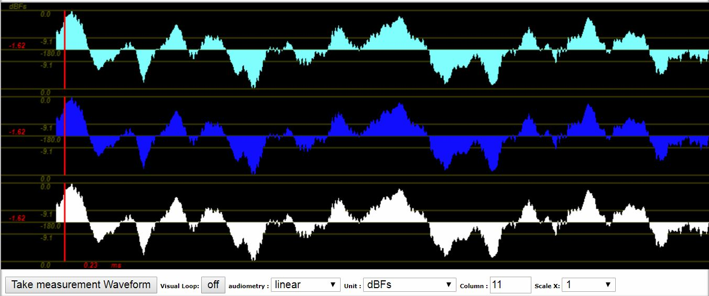  
  
In der Waveform ist erkennbar kein Verlust trotz guter Pegel-Auslastung erkennbar.

  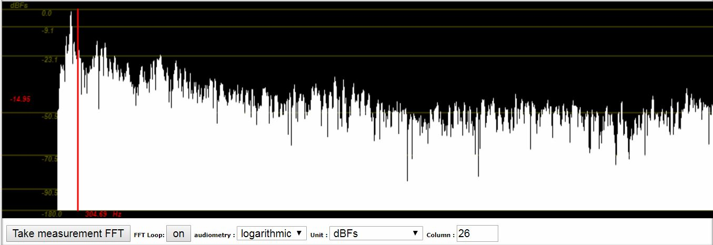
  

    Die Verkehrsgeräusche weißen ein breites Spektrum auf. Alle Ferquenzen sind mehr oder weniger in gleicher Amplitude 
    vorhanden, was als "Rauschen" bezeichnet werden kann.
  

---

  <h1 style="font-size: 18pt">1.4 Aufnahme von Audiosignalen - Impuls</h1>  
  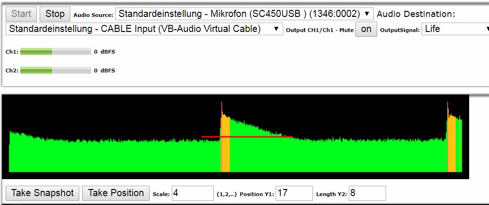
  
Es wurde eine fast vollständige Pegel-Auslastung erreicht.

  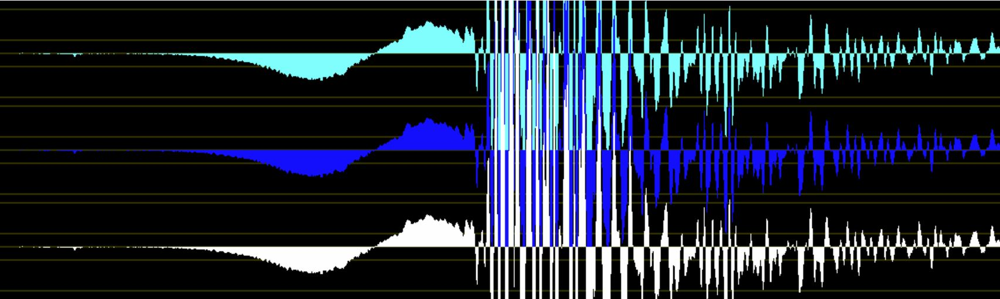
  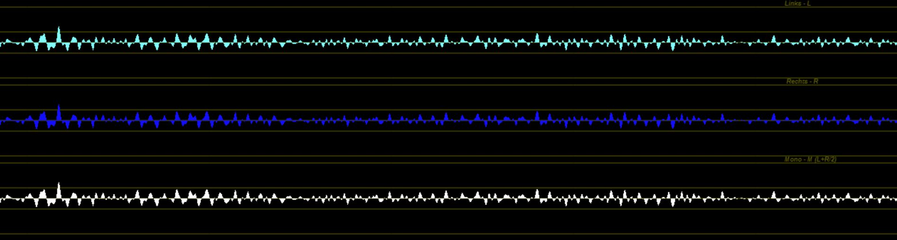
  
Die Waveform zeigt den klar definierten Verlauf eines Impuls. Ein klarer plötzlicher Anstieg der Amplitude, 
    gefolgt durch ein schnelles Abnehmen der Lautstärke innerhalb kurzer Zeit.

  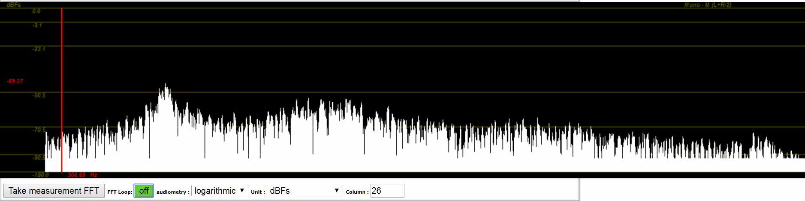
  

    Der Impuls hat eine vermehrte Verteilung im Unteren Frequenzbereich. Alle Frequenzbereiche werden durch das 
    Klangbild abgebildet. Jedoch sind Hohe Frequenzen in abgeschwächter Form erkennbar.
  

---

  <h1 style="font-size: 18pt">1.4 Aufnahme von Audiosignalen - Klavier Tastenton</h1>  
  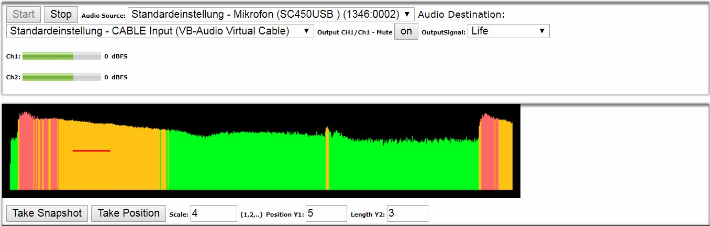
  
Es wurde eine ausreichende Pegel-Auslastung erreicht.

  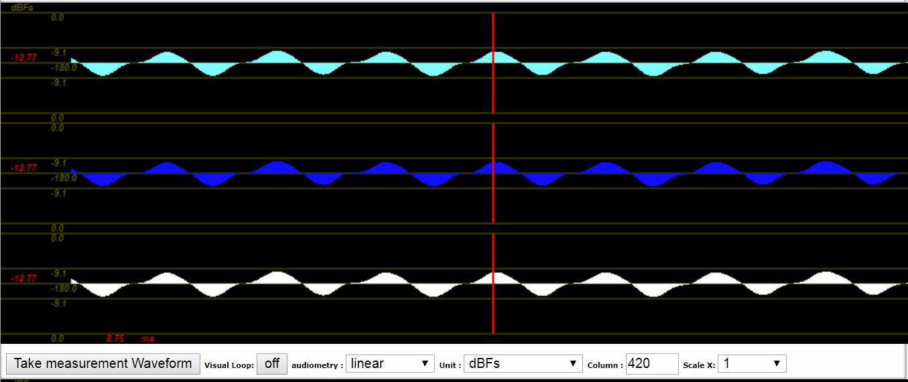
  
Die Waveform zeigt den klar definierten Verlauf eines Sinus-Tons, in diesem Fall ein A. Der Verlauf ist periodisch 
    und die Lautstärke  nimmt nur sehr langsam ab.

  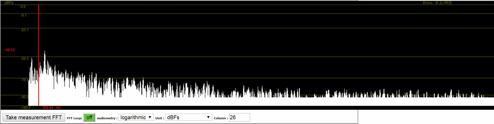
  

    Man kann klar erkennen, dass es sich um einen eher tiefen Ton handelt. Das Klangspektrum ist im unteren Frequenz-
    Bereich klar stärker ausgeprägt. Das Signal hat eine mittlere bis gute Qualität, da es mitunter keine vollständige 
    Pegel-Auslastung gibt.
  

---

  <h1 style="font-size: 18pt">1.5 * - Aufnahme von Sprachsignalen - Phonemisch</h1>  
  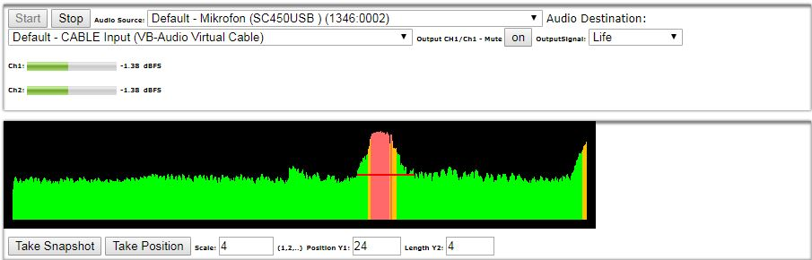
  
Es wurde eine sehr gute Pegel-Auslastung erreicht.

  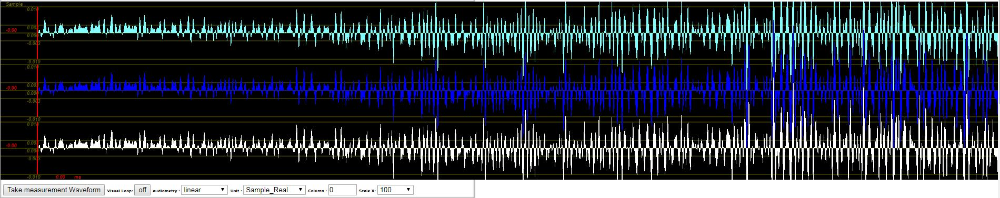
  
Es lässt sich eine periodische Waveform erkennen. Die Amplitude schlägt abwechselnd positiv und negativ aus. Dabei 
    ist der negative und positive Ausschlag in etwa gleich hoch. Außerdem ist der Klang gleichförmig und gleichförmig. 
    Nimmt also weder schlagartig zu noch ab.

  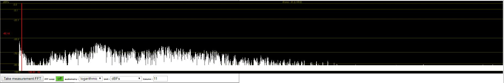
  

    Das Klangspektrum ist zwischen 0Hz und ca. 5kHz verteilt. Mittlere Frequenzen sind dabei stärker vertreten. 
  

---

  <h1 style="font-size: 18pt">1.5 * - Aufnahme von Sprachsignalen - Plosion</h1>  
  
  
Es wurde eine gute Pegel-Auslastung erreicht.

  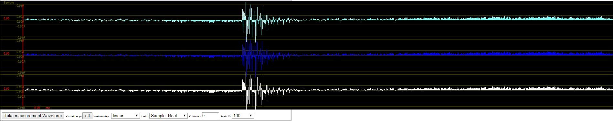
  
Der Klang der Plosion ist der Waveform-Struktur eines Impulses sehr ähnlich. Die Amplitude nimmt schlagartig zu 
    und nimmt recht schnell wieder ab.

  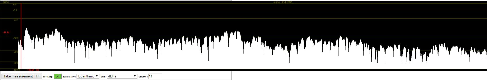
  

    Das Klangspektrum ist ausgeglichen verteilt und ähnelt dem Spektrum des Rauschens.
  

