<!-- $size: A4 -portrait -->

  <h1 style="font-size: 18pt">1.2 Testsignal 100Hz</h1>
  
  
Pegel wird voll ausgelastet. In der Waveform ist zu sehen, dass es dennoch keine Abgeschnittenen Signale gibt.

  
  
In der Waveform kann man den Sinus gut erkennen. 0DBFS ist erreicht worden.

  
  
Es sind kaum Frequenzen aufgenommen worden.

  
Fazit: Das Signal hat eine gute Qualität.

---

  <h1 style="font-size: 18pt">1.2 Testsignal 1000Hz</h1>
  
  
Pegel wird voll ausgelastet. In der Waveform ist zu sehen, dass es dennoch keine Abgeschnittenen Signale gibt.

  
  
In der Waveform kann man den Sinus gut erkennen. 0DBFS ist erreicht worden.

  
  
Es sind keine, bis verschwindend geringe andere Frequenzen aufgenommen worden.

  
Fazit: Das Signal hat eine sehr gute Qualität.

---

  <h1 style="font-size: 18pt">1.2 Testsignal 8000Hz</h1>
  
  
Pegel wird voll ausgelastet. In der Waveform ist zu sehen, dass es dennoch keine Abgeschnittenen Signale gibt.

  
  
In der Waveform kann man den Sinus gut erkennen. 0DBFS ist erreicht worden.

  
  
Es sind keine Frequenzen aufgenommen worden.

  
Fazit: Das Signal hat eine sehr gute Qualität.

---

  <h1 style="font-size: 18pt">1.2 Testsignal Stereo to Mono</h1>
  
  
Pegel wird fast voll ausgelastet.

  
  
In der Waveform kann man den Sinus des Klavierspiels gut erkennen. 0DBFS ist nicht voll erreicht worden. Allerdings sind die Signale in Sinusform klar erkennbar

  
  
Das Klangspektrum ist klar erkennbar. Keine Frequenz wird abgeschnitten oder geht verloren.

  
Fazit: Das Signal hat eine mittlere bis gute Qualität.

---

  <h1 style="font-size: 18pt">1.3 Testsignal - Aufnahme 100Hz</h1>
  
  
Pegel wird voll ausgelastet.

  
  
0DBFS ist fast voll erreicht worden. Die Sinuskurve ist klar erkennbar.

  
  

    Das Klangspektrum ist durch einige Stöhr-Frequenzen gespickt. Es ist jedoch klar zu erkennen, dass die am stärksten
    ausgepräkte Frequenz von 100Hz die Hauptverteilung ausmacht.
  

  
Fazit: Das Signal hat eine gute Qualität.

---

  <h1 style="font-size: 18pt">1.3 Gegenüberstellung/Vergleich - 100Hz - Waveform</h1>
  
Original

  
  
Aufnahme

    
  

    Die Sinuskurve ist im Original definierter und klarer. Der Sinus ist zwar in der Aufnahme noch klar und vollständig erkennbar, 		weißt jedoch Abeichungen auf.
  

---

  <h1 style="font-size: 18pt">1.3 Gegenüberstellung/Vergleich - 100Hz - Spektrum</h1>
  
Original

  
  
Aufnahme

    
  

    Das Original weißt wesentlich weinger fremde Frequenzen auf. In der Aufnahme ist ein leichtes "Rauschen" zu 		erkennen. Dennoch ist das Signal gut aufgenommen worden und hat eine mittlere bis gute Qualität.
  

---

  <h1 style="font-size: 18pt">1.3 Testsignal - Aufnahme 1000Hz</h1>
  
  
Pegel wird voll ausgelastet.

  
  
0DBFS ist fast voll erreicht worden. Die Sinuskurve ist klar erkennbar.

  
  

    Das Klangspektrum ist durch einige Stöhr-Frequenzen gespickt. Es ist jedoch klar zu erkennen, dass die am stärksten
    ausgepräkte Frequenz von 1000Hz die Hauptverteilung ausmacht.
  

  
Fazit: Das Signal hat eine gute bis sehr gute Qualität.

---

  <h1 style="font-size: 18pt">1.3 Gegenüberstellung/Vergleich - 1000Hz - Waveform</h1>
  
Original

  
  
Aufnahme

    
  

    Zwischen Original und Aufnahme ist kaum ein Unterschied auszumachen. Die Qualität der Aufnahme ist nahezu ohne 
    Verluste durchgeführt worden.
  

---

  <h1 style="font-size: 18pt">1.3 Gegenüberstellung/Vergleich - 1000Hz - Spektrum</h1>
  
Original

  
  
Aufnahme

    
  

    Das Original weißt wesentlich weinger fremde Frequenzen auf. In der Aufnahme ist ein leichtes "Rauschen" zu 		erkennen. Dennoch ist das Signal gut aufgenommen worden und hat eine sehr gute Qualität.
  

---

  <h1 style="font-size: 18pt">1.3 Testsignal - Aufnahme 8000Hz</h1>
  
  
Pegel wird voll ausgelastet.

  
  
0DBFS ist fast voll erreicht worden. Die Sinuskurve ist klar erkennbar.

  
  

    Das Klangspektrum ist durch sehr wenige Stöhr-Frequenzen gespickt. Es ist jedoch klar zu erkennen, dass die am 	
    stärksten ausgepräkte Frequenz von 1000Hz die Hauptverteilung ausmacht.
  

  
Fazit: Das Signal hat eine sehr gute Qualität.

---

  <h1 style="font-size: 18pt">1.3 Gegenüberstellung/Vergleich - 8000Hz - Waveform</h1>
  
Original

  
  
Aufnahme

    
  

    Zwischen Original und Aufnahme ist kaum ein Unterschied auszumachen. Die Qualität der Aufnahme ist nahezu ohne 
    Verluste durchgeführt worden.
  

---

  <h1 style="font-size: 18pt">1.3 Gegenüberstellung/Vergleich - 8000Hz - Spektrum</h1>
  
Original

  
  
Aufnahme

    
  

    Das Original weißt wesentlich weinger fremde Frequenzen auf. In der Aufnahme ist ein leichtes "Rauschen" zu 		erkennen. Dennoch ist das Signal gut aufgenommen worden und hat eine sehr gute Qualität.
  

---

  <h1 style="font-size: 18pt">1.4 Aufnahme von Audiosignalen - Verkehrsgeräusche</h1>  
  
  
Es wurde eine fast vollständige Pegel-Auslastung erreicht.

    
  
In der Waveform ist erkennbar kein Verlust trotz guter Pegel-Auslastung erkennbar.

  
  

    Die Verkehrsgeräusche weißen ein breites Spektrum auf. Alle Ferquenzen sind mehr oder weniger in gleicher Amplitude 
    vorhanden, was als "Rauschen" bezeichnet werden kann.
  

---

  <h1 style="font-size: 18pt">1.4 Aufnahme von Audiosignalen - Impuls</h1>  
  
  
Es wurde eine fast vollständige Pegel-Auslastung erreicht.

  
  
  
Die Waveform zeigt den klar definierten Verlauf eines Impuls. Ein klarer plötzlicher Anstieg der Amplitude, 
    gefolgt durch ein schnelles Abnehmen der Lautstärke innerhalb kurzer Zeit.

  
  

    Der Impuls hat eine vermehrte Verteilung im Unteren Frequenzbereich. Alle Frequenzbereiche werden durch das 
    Klangbild abgebildet. Jedoch sind Hohe Frequenzen in abgeschwächter Form erkennbar.
  

---

  <h1 style="font-size: 18pt">1.4 Aufnahme von Audiosignalen - Klavier Tastenton</h1>  
  
  
Es wurde eine ausreichende Pegel-Auslastung erreicht.

  
  
Die Waveform zeigt den klar definierten Verlauf eines Sinus-Tons, in diesem Fall ein A. Der Verlauf ist periodisch 
    und die Lautstärke  nimmt nur sehr langsam ab.

  
  

    Man kann klar erkennen, dass es sich um einen eher tiefen Ton handelt. Das Klangspektrum ist im unteren Frequenz-
    Bereich klar stärker ausgeprägt. Das Signal hat eine mittlere bis gute Qualität, da es mitunter keine vollständige 
    Pegel-Auslastung gibt.
  

---

  <h1 style="font-size: 18pt">1.5 * - Aufnahme von Sprachsignalen - Phonemisch</h1>  
  
  
Es wurde eine sehr gute Pegel-Auslastung erreicht.

  
  
Es lässt sich eine periodische Waveform erkennen. Die Amplitude schlägt abwechselnd positiv und negativ aus. Dabei 
    ist der negative und positive Ausschlag in etwa gleich hoch. Außerdem ist der Klang gleichförmig und gleichförmig. 
    Nimmt also weder schlagartig zu noch ab.

  
  

    Das Klangspektrum ist zwischen 0Hz und ca. 5kHz verteilt. Mittlere Frequenzen sind dabei stärker vertreten. 
  

---

  <h1 style="font-size: 18pt">1.5 * - Aufnahme von Sprachsignalen - Plosion</h1>  
  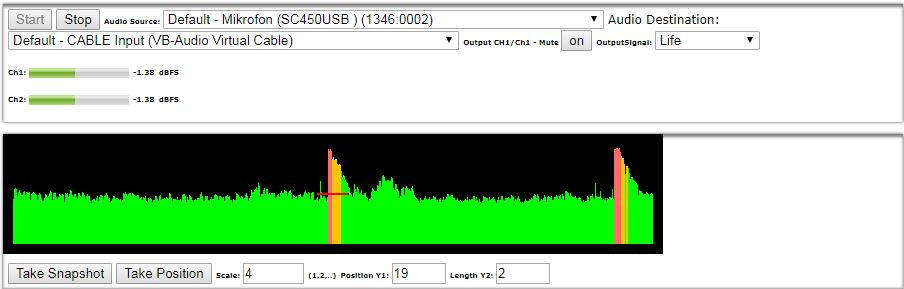
  
Es wurde eine gute Pegel-Auslastung erreicht.

  
  
Der Klang der Plosion ist der Waveform-Struktur eines Impulses sehr ähnlich. Die Amplitude nimmt schlagartig zu 
    und nimmt recht schnell wieder ab.

  
  

    Das Klangspektrum ist ausgeglichen verteilt und ähnelt dem Spektrum des Rauschens.
  

---

  <h1 style="font-size: 18pt">1.5 * - Aufnahme von Sprachsignalen - Gegenüberstellung</h1>  
  
Phonemisch

  
  
Plosion

  
  
Phonemische Klänge sind periodischer und langanhaltender. Plosionen sind impulsiv und sporadisch.

  
Phonemisch

  
  
Plosion

  
  
Das Phonemische Spektrum ist weniger diversifiziert. Das Spektrum der Plosion ist ausgeprägter und breiter.

---

  <h1 style="font-size: 18pt">1.6 * - Aufnahme von Sprachsignalen mit Hintergrundsignalen</h1>  
  
Sprachsignal - keine Hintergrundsignale

  
  
  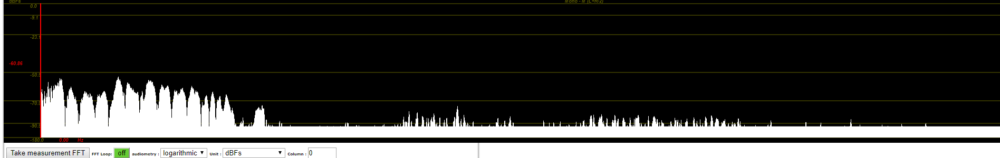
  

    Gute Pegelauslastung, kompakter Frequenzbereich des Sprachsignals sichtbar
  

---

  <h1 style="font-size: 18pt">1.6 * - Aufnahme von Sprachsignalen mit Hintergrundsignalen</h1>  
  
Sprachsignal - geringe Hintergrundsignale

  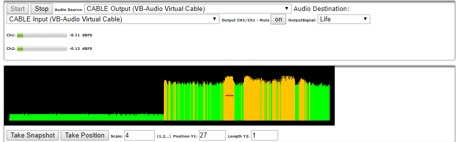
  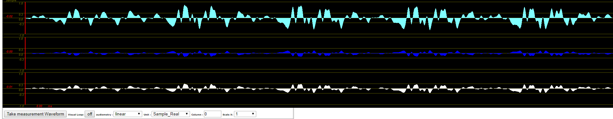
  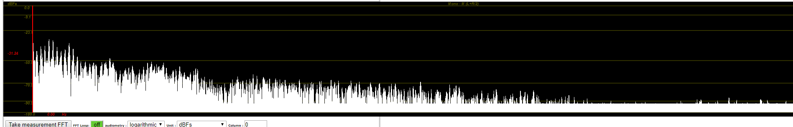
  

    Gute Pegelauslastung, Rauschpegel ist angestiegen, Frequenzbereich des Sprachsignals durch Hintergrundfrequenzen vergrößert
  

---

  <h1 style="font-size: 18pt">1.6 * - Aufnahme von Sprachsignalen mit Hintergrundsignalen</h1>  
  
Sprachsignal - viele Hintergrundsignale

  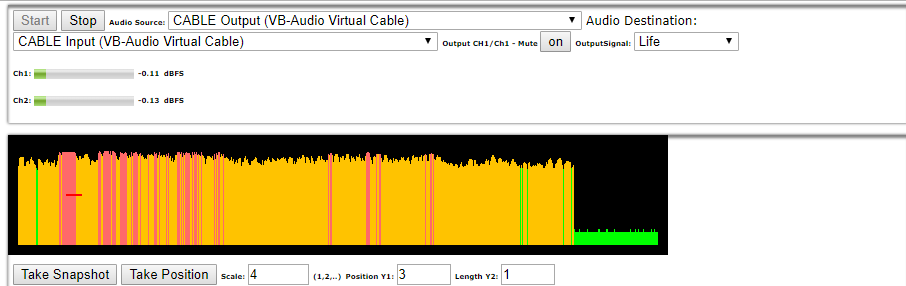
  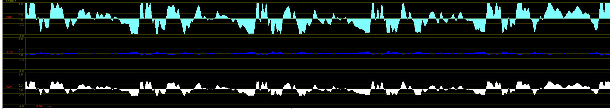
  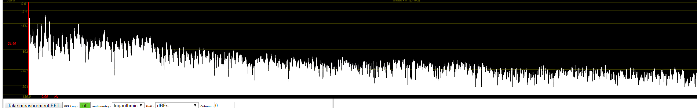
  

    Hohe Pegelauslastung, Rauschpegel ist weiter angestiegen, mehr und größere Amplituden, Frequenzbereich des Sprachsignals durch Hintergrundfrequenzen nicht mehr erkennbar
  

---

  <h1 style="font-size: 18pt">1.6 * - Aufnahme von Sprachsignalen mit Hintergrundsignalen</h1>  
  
Sprachsignal - Pegel - Gegenüberstellung keine vs. geringe vs. viele Hintergrundsignale 

  
  
  
  

    Anstieg des durchschnittlichen Grundpegels lässt sich auf den Anstieg der Hintergrundsignale zurückführen.
  

---

  <h1 style="font-size: 18pt">1.6 * - Aufnahme von Sprachsignalen mit Hintergrundsignalen</h1>  
  
Sprachsignal - Waveform - Gegenüberstellung keine vs. geringe vs. viele Hintergrundsignale

  
  
  
  

    Hintergrundsignale sind auf der Waveform nicht direkt erkennbar, höchstens durch die ansteigende Größe der Amplituden.
  

---

  <h1 style="font-size: 18pt">1.6 * - Aufnahme von Sprachsignalen mit Hintergrundsignalen</h1>  
  
Sprachsignal - Spektrum - Gegenüberstellung keine vs. geringe vs. viele Hintergrundsignale

  
  
  
  

    Die Hintergrundsignale erweitern das Frequenzspektrum deutlich. Auch im Bereich des Sprachsignals ist ein Frequenzanstieg zu verzeichnen, wodurch das Sprachsignal überdeckt wird und nicht mehr klar sichtbar ist.
  

---

  <h1 style="font-size: 18pt">1.7 * - Dynamische Mikrophon-Aufzeichnung</h1>  
  
Sprachsignal - keine Bewegung

  
  
  
  

    Hoher Tiefen-Anteil im Frequenz-Spektrum. Pegelauslastung bei ca. 80%. Klares Signal von mittlerer bis guter 		Qualität.
  

---

  <h1 style="font-size: 18pt">1.7 * - Dynamische Mikrophon-Aufzeichnung</h1>  
  
Sprachsignal - geringe Bewegung

  
  
  
  

    Hoher Tiefen-Anteil im Frequenz-Spektrum, aber mehr mittlere bis hohe Frequenzen durch den leichten Luftstrom. 		Pegelauslastung bei ca. 90%. Klares Signal von mittlerer bis guter Qualität.
  

---

  <h1 style="font-size: 18pt">1.7 * - Dynamische Mikrophon-Aufzeichnung</h1>  
  
Sprachsignal - schnelle Bewegung

  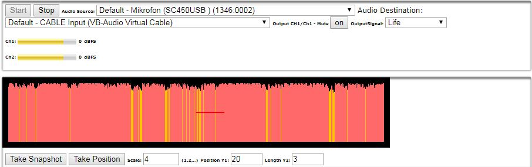
  
  
  

    Hoher Anteil aller Frequenzen in Spektrum. Das Spektrum weist eine rauschähnliche Signatur auf. Pegelauslastung bei 	nahezu 100%. Das Signal hat aufgrund der vielen Stöhr-Frequenzen stark an Qualität verloren.
  

---

  <h1 style="font-size: 18pt">1.7 * - Dynamische Mikrophon-Aufzeichnung</h1>  
  
Sprachsignal - Pegeldarstellung - Gegenüberstellung Still vs. Gering vs Schnelle Bewegung

  
  
  
  

    An der Pegelauslastung ist das Rauschen sehr gut zu erkennen. Immer höhere Amplituden-Werte deuten auf viele 		Stöhr-Frequenzen hin.
  

---

  <h1 style="font-size: 18pt">1.7 * - Dynamische Mikrophon-Aufzeichnung</h1>  
  
Sprachsignal - Waveform - Gegenüberstellung Still vs. Gering vs Schnelle Bewegung

  
  
  
  

    Durch die Stöhr-Frequenzen ist die ursprüngliche Struktur des Signals sichtlich verfälscht. Bei zunehmendem 		Luftstrom wird das Sginal unruhiger. Bei starkem Luftstrom wirkt die Waveform "abgehackt" und unstimmig.
  

---

  <h1 style="font-size: 18pt">1.7 * - Dynamische Mikrophon-Aufzeichnung</h1>  
  
Sprachsignal - Spektrum - Gegenüberstellung Still vs. Gering vs Schnelle Bewegung

  
  
  
  

    Das Spektrum wird zunehmend durch ein weißes Rauschen ergänzt. Es ist klar erkennbar, dass durch den Luftstrom 		diverse Frequenzen das Spektrum ergänzen. Besonders im höheren Frequenz-Bereich ist ein signifikanter Anstieg zu	verzeichnen.
  

---

  <h1 style="font-size: 18pt">1.7 * - Dynamische Mikrophon-Aufzeichnung</h1>  
  
Impuls - keine Bewegung

  
  
  
  

    Pegelauslastung ist optimal, da selbst beim initialen Anstieg der Amplitude zu Beginn des Impulses nichts 			abgeschnitten wird. Der Impuls-Verlauf ist in der Waveform klar erkennbar. Das Spektrum hat eine gleichmäßige 		Verteilung.
  

---

  <h1 style="font-size: 18pt">1.7 * - Dynamische Mikrophon-Aufzeichnung</h1>  
  
Impuls - geringe Bewegung

  
  
  
  

    Pegelauslastung ist optimal, da selbst beim initialen Anstieg der Amplitude zu Beginn des Impulses nichts 			abgeschnitten wird. Der Impuls-Verlauf ist in der Waveform ebenfalls noch klar erkennbar. Das Spektrum hat noch 	immer eine relativ gleichmäßige Verteilung.
  

---

  <h1 style="font-size: 18pt">1.7 * - Dynamische Mikrophon-Aufzeichnung</h1>  
  
Impuls - schnelle Bewegung

  
  
  
  

    Durch den Luftstrom ist der Impuls in der Aufnahme nicht direkt erkennbar. Der Impuls-Verlauf ist in der Waveform
    ebenfalls allerdings noch erkennbar. Das Spektrum hat eine rauschartige Signatur und einen hohen Anteil an sehr 	tiefen Frequenzen.
  

---

  <h1 style="font-size: 18pt">1.7 * - Dynamische Mikrophon-Aufzeichnung</h1>  
  
Impuls - Pegeldarstellung - Gegenüberstellung Still vs. Gering vs Schnelle Bewegung

  
  
  
  

    An der Pegelauslastung ist das Rauschen sehr gut zu erkennen. Immer höhere Amplituden-Werte deuten auf viele 		Stöhr-Frequenzen hin, bis der Impuls im Aufnahme-Verlauf kaum mehr zu sehen ist.
  

---

  <h1 style="font-size: 18pt">1.7 * - Dynamische Mikrophon-Aufzeichnung</h1>  
  
Impuls - Waveform - Gegenüberstellung Still vs. Gering vs Schnelle Bewegung

  
  
  
  

    Der Impuls-Verlauf ist bei keinem sowie geringem Luftstrom Klar erkennbar und nimmt recht schnell in typischer Form 	ab. Bei starkem Luftstrom ist sein Verlauf allerdings von anderer Form und nimmt langsamer ab bzw. erhält seine 	Amplitude länger, als unter reinen Bedingungen.
  

---

  <h1 style="font-size: 18pt">1.7 * - Dynamische Mikrophon-Aufzeichnung</h1>  
  
Impuls - Spektrum - Gegenüberstellung Still vs. Gering vs Schnelle Bewegung

  
  
  
  

    Das Spektrum ist trotz des Luftstroms kaum verändert. Es handelt sich in jedem Fall um eine rauschartige Signatur.
  

---

  <h1 style="font-size: 18pt">1.8 * - Aufnahme in unterschiedlichen akustischen Räumen</h1>  
  
Sprachsignal - schalltoter Raum

    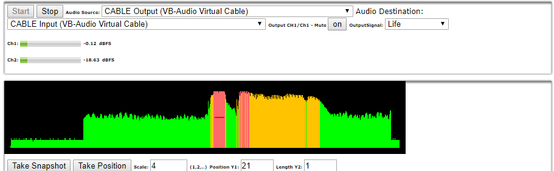
    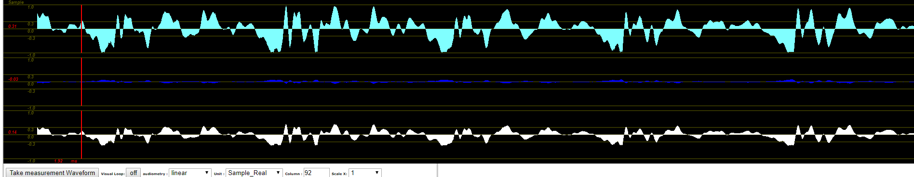
    
  

    Gute Pegelauslastung, gleichmäßige Amplituden, Sprachfrequenzbereich klar erkennbar
  

---

  <h1 style="font-size: 18pt">1.8 * - Aufnahme in unterschiedlichen akustischen Räumen</h1>  
  
Sprachsignal - mäßiger Reflextionsraum

    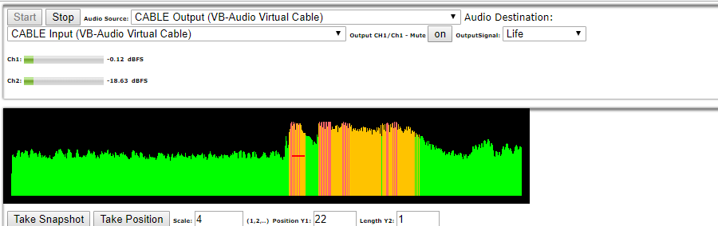
    
    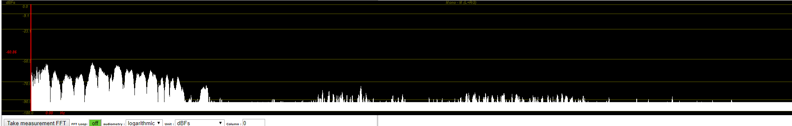
  

    Gute Pegelauslastung, im ersten Drittel sich wiederholende Amplituden klar erkennbar, Sprachfrequenzbereich klar erkennbar
  

---

  <h1 style="font-size: 18pt">1.8 * - Aufnahme in unterschiedlichen akustischen Räumen</h1>  
  
Sprachsignal - hoher Reflextionsraum

    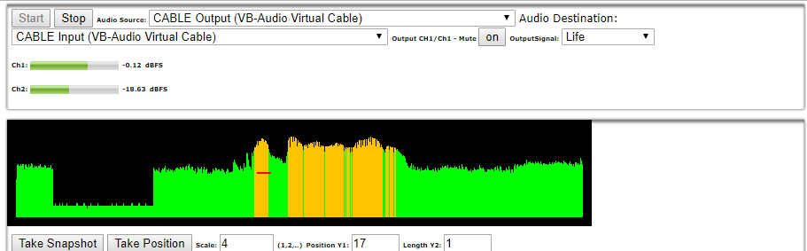
    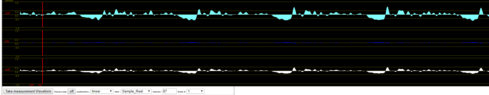
    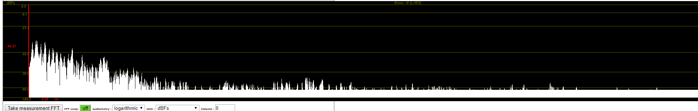
  

    Gute Pegelauslastung, unregelmäßiger Amplitudenverlauf, Sprachfrequenzbereich klar erkennbar
  

---

  <h1 style="font-size: 18pt">1.8 * - Aufnahme in unterschiedlichen akustischen Räumen</h1>  
  
Sprachsignal - Pegel - Gegenüberstellung keine vs. mäßige vs hohe Reflexion

    
    
    
  

    Je größer der Halleffekt, desto unregelmäßiger wird der Pegelverlauf.
  

---

  <h1 style="font-size: 18pt">1.8 * - Aufnahme in unterschiedlichen akustischen Räumen</h1>  
  
Sprachsignal - Waveform - Gegenüberstellung keine vs. mäßige vs hohe Reflexion

    
    
    
  

    Mit der Zunahme der Signalreflexion werden die Amplituden immer unregelmäßiger. 
  

---

  <h1 style="font-size: 18pt">1.8 * - Aufnahme in unterschiedlichen akustischen Räumen</h1>  
  
Sprachsignal - Spektrum - Gegenüberstellung keine vs. mäßige vs hohe Reflexion

    
    
    
  

    Der Frequenzbereich verändert sich nicht.
  

---

  <h1 style="font-size: 18pt">1.8 * - Aufnahme in unterschiedlichen akustischen Räumen</h1>  
  
Impuls - schalltoter Raum

    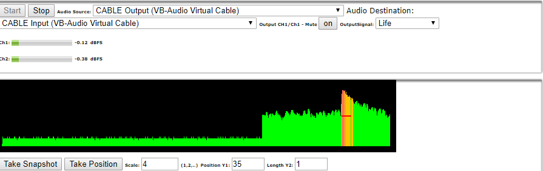
    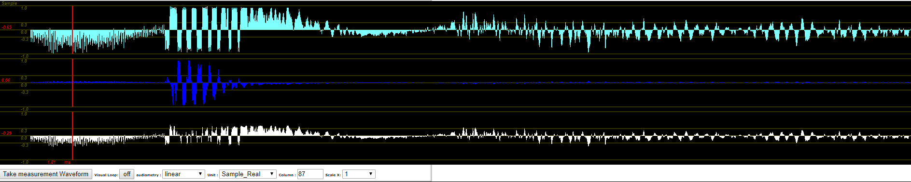
    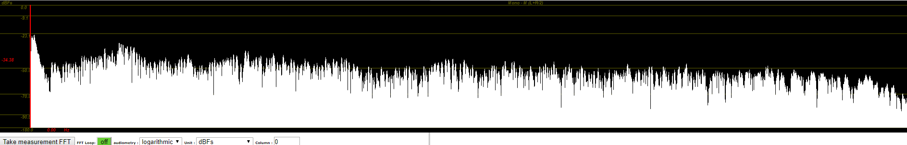
  

    Gute Pegelauslastung, Impuls klar ersichtlich, gleichmäßige Amplituden, großes Frequenzspektrum
  

---

  <h1 style="font-size: 18pt">1.8 * - Aufnahme in unterschiedlichen akustischen Räumen</h1>  
  
Impuls - mäßiger Reflexionsraum

    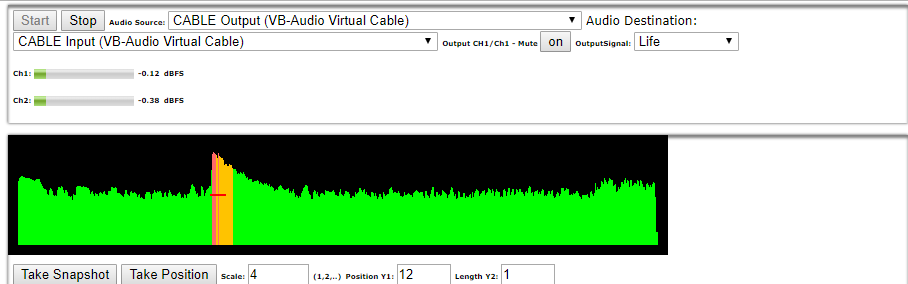
    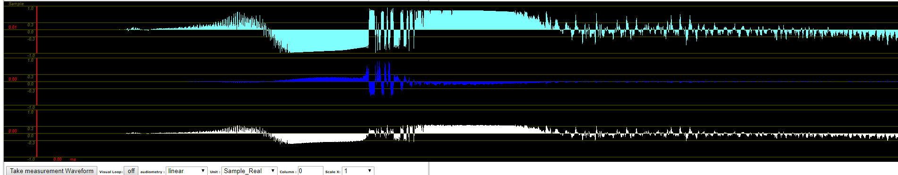
    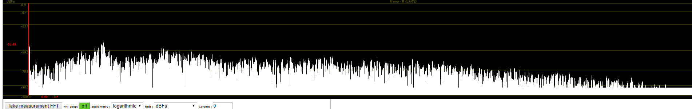
  

    Gute Pegelauslastung, Impuls klar ersichtlich, gebündelte Amplituden direkt nach dem Impuls sichtbar, großes Frequenzspektrum
  

---

  <h1 style="font-size: 18pt">1.8 * - Aufnahme in unterschiedlichen akustischen Räumen</h1>  
  
Impuls - hoher Reflexionsraum

    
    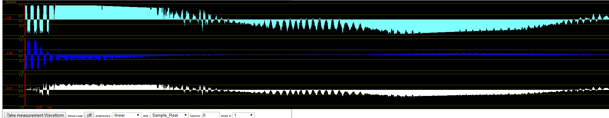
    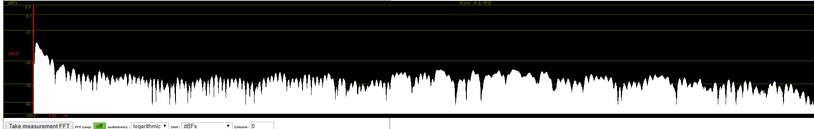
  

    Gute Pegelauslastung, Impuls klar ersichtlich, gebündelte Amplituden nach dem Impuls, großes Frequenzspektrum
  

---

  <h1 style="font-size: 18pt">1.8 * - Aufnahme in unterschiedlichen akustischen Räumen</h1>  
  
Impuls - Pegel - Gegenüberstellung keine vs. mäßige vs hohe Reflexion

    
    
    
  

    Kein wesentlicher Unterschied erkennbar
  

---

  <h1 style="font-size: 18pt">1.8 * - Aufnahme in unterschiedlichen akustischen Räumen</h1>  
  
Impuls - Waveform - Gegenüberstellung keine vs. mäßige vs hohe Reflexion

    
    
    
  

    Je größer die Reflexion umso stärker überlappen/ bündeln sich die Amplituden 
  

---

  <h1 style="font-size: 18pt">1.8 * - Aufnahme in unterschiedlichen akustischen Räumen</h1>  
  
Impuls - Spektrum - Gegenüberstellung keine vs. mäßige vs hohe Reflexion

    
    
    
  

    Frequenzspektrum ändert sich nicht.
  

---

  <h1 style="font-size: 18pt">1.10 * - Manipulation von Audiosignalen</h1>  
  
Aufgezeichnetes Signal - Original - Unverändert

  
    
  

    Der Pegel des Signals wurde mit der Funktion "Amplify" verstaerkt, um eine gute Auslasung zu erreichen.
  

---

  <h1 style="font-size: 18pt">1.10 * - Manipulation von Audiosignalen</h1>  
  
Aufgezeichnetes Signal - Original - Unverändert

  
  
  
  

    Der Pegel wird gut ausgelastet und das Signal hat eine gute Qualität. Das Spektrum hat einen hohen Anteil tiefer 	Frequenzen. Dies wird auch durch die Waveform bzw. anhand der gut zu erkennenden langen Periodendauer ersichtlich.
  

---

  <h1 style="font-size: 18pt">1.10 * - Manipulation von Audiosignalen</h1>  
  
Tiefpassfilter - Hohe Frequenzen abgeschnitten

  
  

    Im Editor wurde ein Tiefpass-Filter genutzt, um die Hohen-Frequenz-Anteile zu veringern bzw. abzuschneiden.
  

---

  <h1 style="font-size: 18pt">1.10 * - Manipulation von Audiosignalen</h1>  
  
Tiefpassfilter - Hohe Frequenzen abgeschnitten

  
  
  
  

    Im Spektrum ist eine klare Abnahme der hohen Frequenzen erkennbar. Die Waveform zeigt klar die nicht mehr optimale  	Pegel-Auslastung. Das Spektrum ist klar um hohe Frequenzen verringert.
  

---

  <h1 style="font-size: 18pt">1.10 * - Manipulation von Audiosignalen</h1>  
  
Gegenüberstellung - Waveform - Hohe Frequenzen abgeschnitten

  
  
  

    Die Waveform ist durch die Abnahme hohe Frequenzen klarer erkennbar. Die Periodenverläufe tiefer Frequenzen ist klar erkennbar.
  

---

  <h1 style="font-size: 18pt">1.10 * - Manipulation von Audiosignalen</h1>  
  
Gegenüberstellung - Spektrum - Hohe Frequenzen abgeschnitten

  
  
  

    Der Tiefpassfilter hat den hohen Frequenzbereich klar verringert/abgeschnitten. Im hohen Frequenz-Spektrum sind keine Werte messbar.
  

---

  <h1 style="font-size: 18pt">1.10 * - Manipulation von Audiosignalen</h1>  
  
Hochpassfilter - Verstaerkung - Tiefe Frequenzen vermindert - Hohe Frequenzen verstaerkt

  
  

    Im Editor wurde ein Hochpass-Filter genutzt, um die Tiefen-Frequenz-Anteile zu veringern. Anschließend wurde das Signal verstärkt.
  

---

  <h1 style="font-size: 18pt">1.10 * - Manipulation von Audiosignalen</h1>  
  
Hochpassfilter - Verstaerkung - Tiefe Frequenzen vermindert - Hohe Frequenzen verstaerkt

  
  
  
  

    Die tiefen Frequenz-Werte haben sichtlich abgenommen, hohe Frequenzen wurden verstärkt. die Waveform ist sichtbar "unruhiger".
  

---

  <h1 style="font-size: 18pt">1.10 * - Manipulation von Audiosignalen</h1>  
  
Gegenüberstellung - Tiefe Frequenzen vermindert - Hohe Frequenzen verstärkt vs Original

  
  
  

    Die Zunahme hoher Frequenzen ist in der Waveform gut zu erkennen. Der periodische Verlauf ist bezogen auf tiefe Frequenzen nicht mehr so klar erkennbar und wird von den Interferenzen der hohen Frequenzbereiche überlagert.
  

---

  <h1 style="font-size: 18pt">1.10 * - Manipulation von Audiosignalen</h1>  
  
Gegenüberstellung - Tiefe Frequenzen vermindert - Hohe Frequenzen verstärkt vs Original

  
  
  

    Der Anteil tiefer Frequenzbereiche hat klar abgenommen und wurde "gedämpft". Hohe Frequenzen haben in ihrer Ausprägung zugenommen. Da der Anteil hoher Frequenzen im Signal ohnehin nicht große war, ist die Zunahme der gemessenen Werte war sichtbar, aber nicht signifikant gestiegen.
  

  <h1 style="font-size: 18pt">1.11 * - Produktionsumgebung</h1>  
  
Signalflussplan

  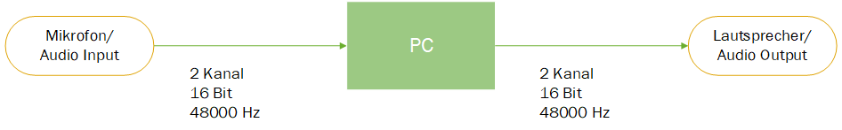
  

  

