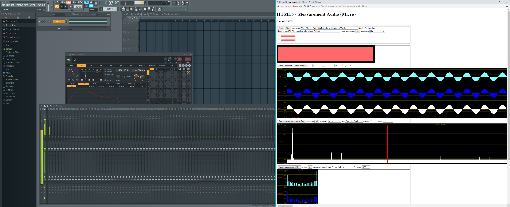
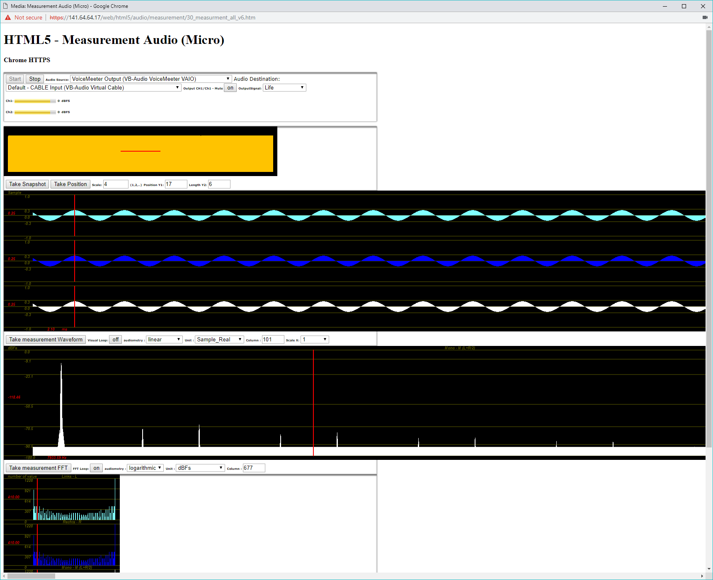
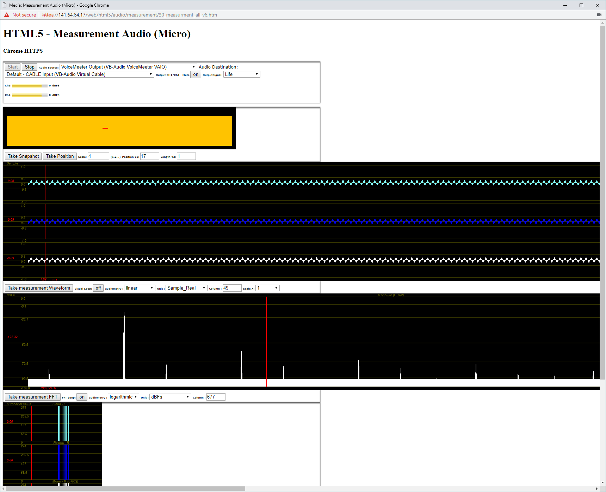
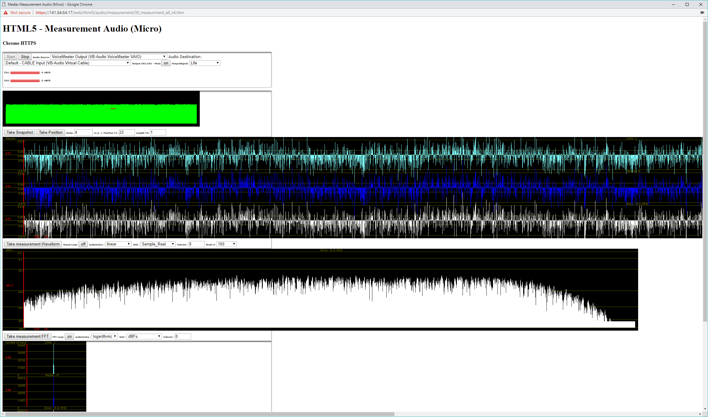
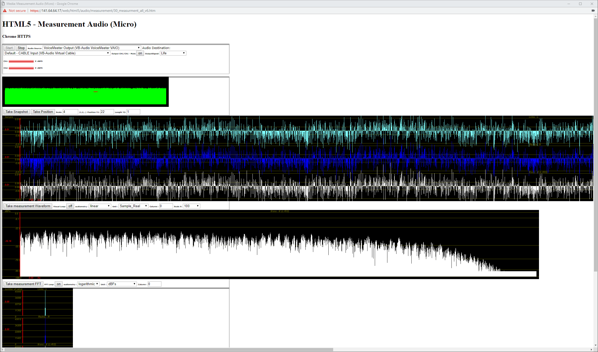
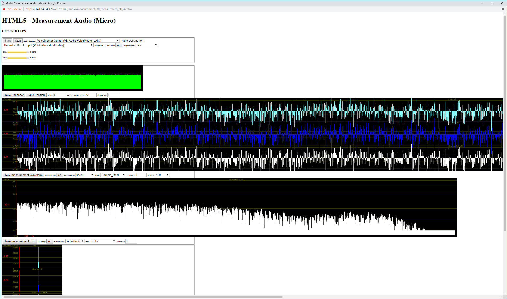
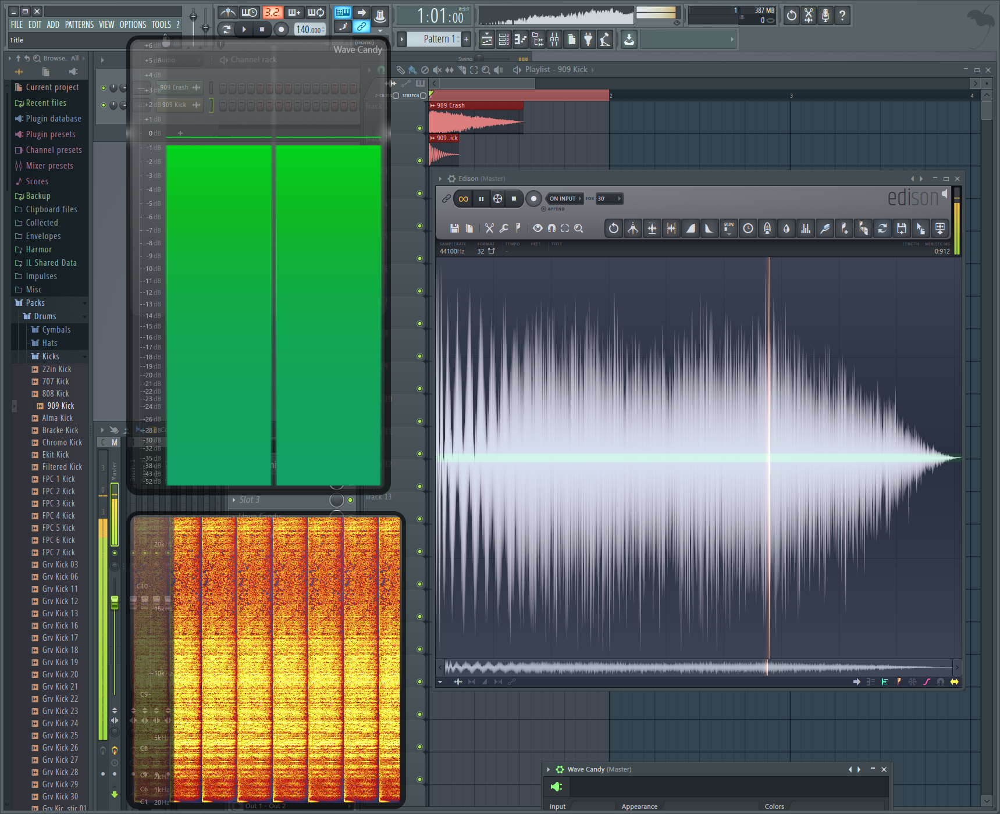
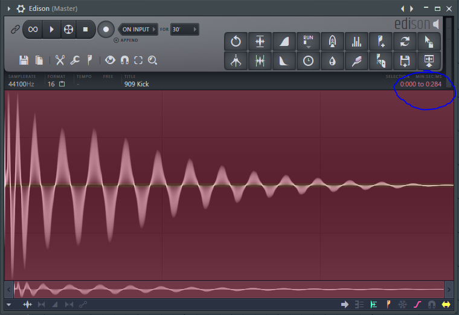

# Wie lautet die Formel für die Berechnung der vollständigen Sinusfunktion?

`iOutput[i] = Math.sin(2 * Math.PI * iHorizontalFrequency / iSampleRate * i);`

# Erstellen Sie die Anwendung Sinusgenerator mit einem harmonischen Klang bestehend aus drei Sinusschwingungen

Bei Wellen mit höherer Amplitude schlägt der Peak weiter von der Amplitudenmitte aus.

Bei 800hz schlägt der Peak doppelt so oft aus wie bei 400hz im gleichen Zeitfenster. 

\ 

\ 

\pagebreak

Bei 3200hz schlägt der Peak acht mal so oft aus wie bei 400hz. Die Phase bestimmt bei welchem Punkt auf einer Periode die Welle beginnt.

\ 

\pagebreak

# Stellen Sie an der Anwendung ein:

- **0 kHz**
- **2 kHz**
- **4 kHz**
- **(Samplingfrequenz/2)+4kHz**
- **(Samplingfrequenz/2)-4kHz**
- **Samplingfrequenz/2**

## Welche Frequenzen erscheinen?

+---------------------------+-----------------------------+
| input frequenz			| erscheinende frequenz       |
+===========================+=============================+
| 0hz\  					| keine\                      |
| 2khz\   			        | 2khz\                       |
| 4khz\ 					| 4khz\                       |
| (Samplingfrequenz/2)+4kHz | 4khz\                       |
| (Samplingfrequenz/2)-4kHz | (Samplingfrequenz-4000)hz   |
| Samplingfrequenz/2 	    | Samplingfrequenz/2          |
+---------------------------+-----------------------------+

# Was würde passieren, wenn man geeignet Bandbegrenzen würde

Frequenzen die größer sind als die Samplerate werden nicht mehr wiedergegeben.

# Bestimmen Sie den Wert für die halbe Lautstärke in dB!

Halbe Lautstärke ist immer ((jetzige lautstärke) - 10db) oder auch (Amplitude / 2)

# Bestimmen Sie eine Verzögerung bei einer Reflexion an einer Wand von 112/2 m Entfernung.

velocity / distance = travel time

343ms/s / 112m = 0.326s

## Um wie viele Abtastwerte müssen die Samples verzögert werden 

samplerate * travel time = amount of samples

48000 * 0.326s = **15648 samples**

## Wie lang ist der Samplebuffer "signal_buf1", wenn wir mit einer Abtastrate von 48 kHz (44.1) arbeiten

16348 samples

\pagebreak

# Hochpass / Tiefpass erster und zweiter Ordnung

Ein Tiefpass reduziert die Amplitude der höheren Frequenzen. Der Hochpass demzufolge die tieferen Frequenzen.

\ 

\ 

\pagebreak

Ein Hochpass zweiter Ordnung schwächt den Amplituden höherer Frequenzen ab wie der Hochpass erster Ordnung, jedoch ist die Abschwächung stärker. Außerdem bildet sich ein Resonanz-Berg in den höheren Frequenzen.

\ 

\pagebreak

# Erstellen Sie je ein Screenshot von der Pegel, Spektrum- und Waveformdarstellung der Signale mit allen Werten und Einheiten!

\ 

# Bei welcher Wahrnehmungsschwelle (Spieldauer) ist das Testsignal nicht eindeutig identifizierbar?

Die Fragestellung ergibt keinen Sinn. In welchem Sinne identifizierbar? Hörbar ist das störende Signal auch noch bei 1ms Länge. Bitte erläutern Sie die Fragestellung.

\pagebreak

# Berechnen Sie die Spieldauer für die Störung in dB!

284ms.

\ 

# Berechnen Sie die Dynamik für das Objekt in dB!

-\infty\ dbfs bis 0dbfs dem folgt: Dynamik = \infty\ dbfs

# Bei welcher Wahrnehmungsschwelle (Spieldauer) ist das Testsignal eindeutig identifizierbar? (Objekt)

Das gleiche Ergebnis wie bei *"Bei welcher Wahrnehmungsschwelle (Spieldauer) ist das Testsignal nicht eindeutig identifizierbar?"*

# Erstellen Sie je ein Screenshot von der Pegel, Spektrum- und Waveformdarstellung der Signale mit allen Werten und Einheiten!

Sie wiederholen sich.
