<!-- $size: a4 -portrait -->

# Audio 3.1 DeltaKompression
### d)

  i. Fehler bei Quantisierung von 1

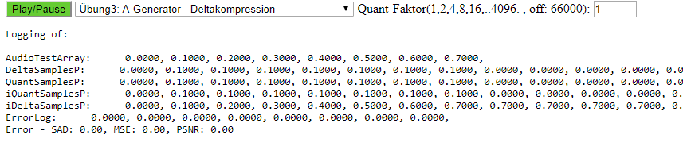

  ii. Fehler bei Quantisierung von 8

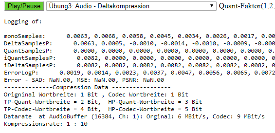

---

# Audio 3.2 SubbandKompression
### c)
  i. Fehler bei Quantisierung von 1

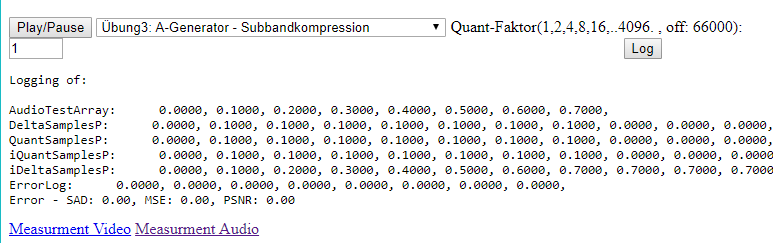

  ii. Fehler bei Quantisierung von 8

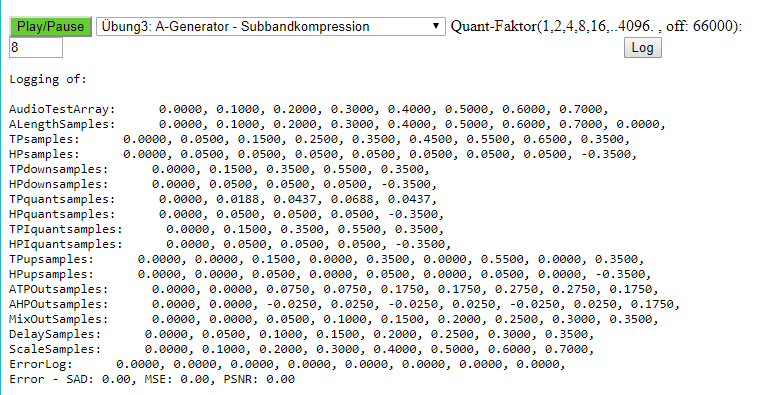

---

# Audio 3.3 FFT
### c)
  i. Fehler bei Quantisierung von TP: 1 HP: 1 Grenzwert: 1

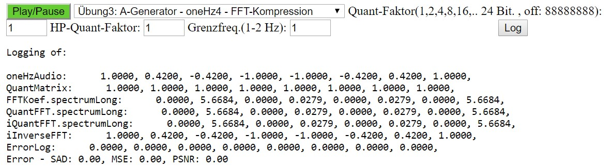

  ii. Fehler bei Quantisierung von TP: 16 HP: 32 Grenzwert: 1

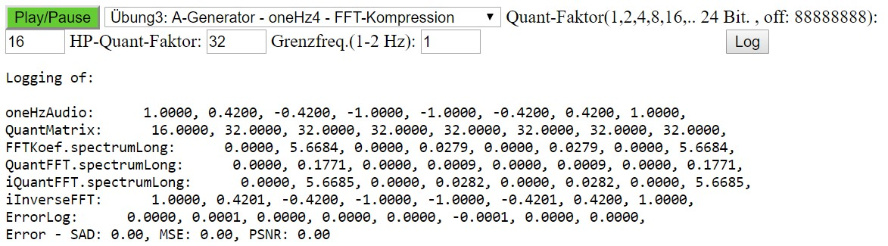

---

# Audio 3.4 Delta
### b) höchste Quantisierung bei bester Wahrnehmungs-Qualität

  1500

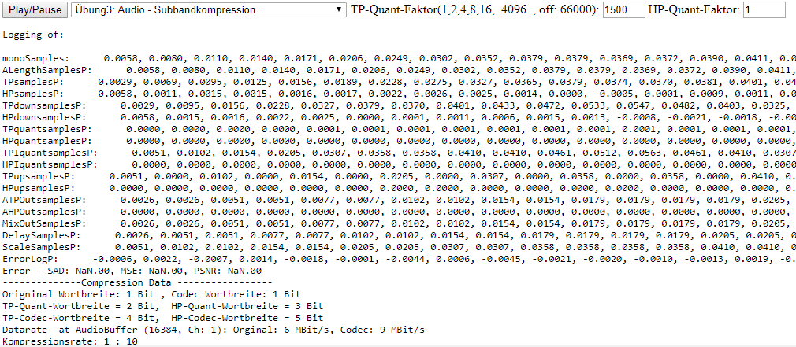

### c) Wortbreite bei der optimalen Quantisierung

  16 bit

### d) Datenrate bei 48kHz

  Unkomprimierte Datenrate:

  samplerate \* word size \* channels

  48000 \* 16bit \* 2 = 1536000 bit/s

  1536000 bit/ = 192000 byte/s = 192 kbyte/s

  Komprimierte Datenrate (wort längen reduktion) bei quant. Fakt. 2:

  48000 \* 15bit \* 2 = 1440000 bit/s

  1440000 bit/s = 180000 byte/s = 180 kbyte/s

### e) Kompression

  Runden mit Quantisierungsfaktor 6

  Wertebereich 17Bit (Statt 16Bit)
  -64.000 bis +64.000

  Bestimmen der höchten Quantisierung bei bester Wahrnehmungsqualität:

  Q=64 -> 6 bit weil 2^6 = 64

  Berechnen der optimalen Wortbreite bei der optimalen Quantisierung:

  17 bit - 6 bit = 11 bit (17 bit weil bei der Deltakomp. 1 bit hinzugefügt wird.)

### f) Measurement

 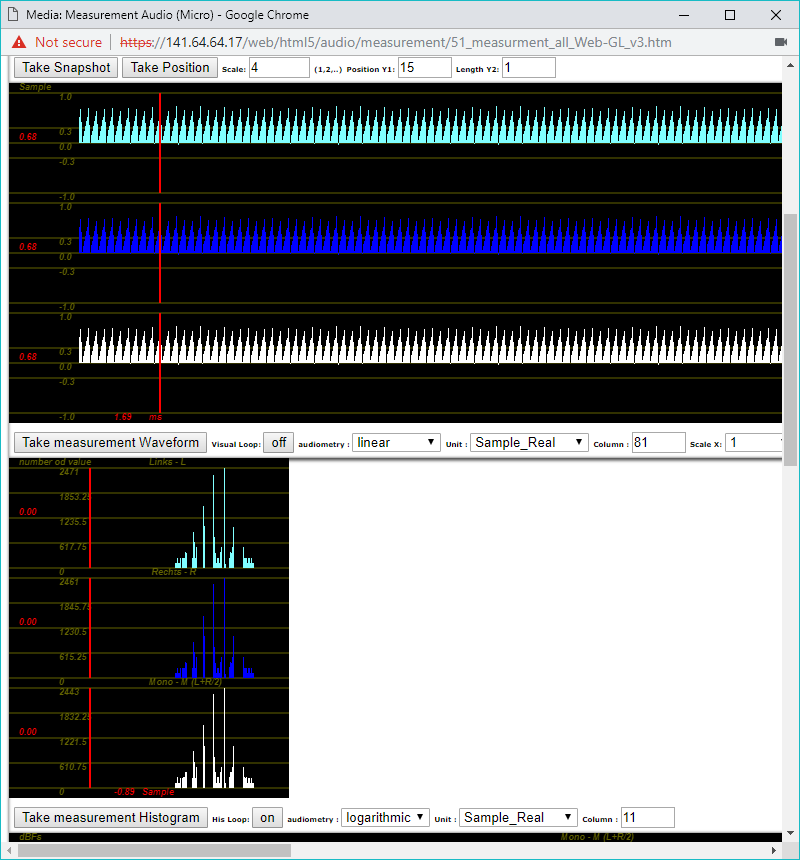

 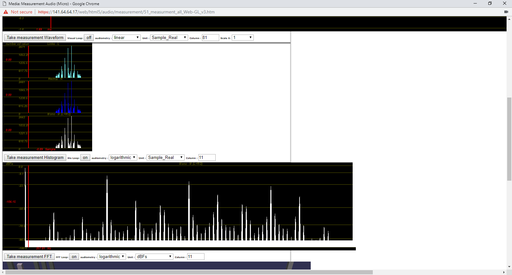

 

# Audio 3.5 Subband
### b) höchste Quantisierung bei bester Wahrnehmungs-Qualität

1500

### c) Wortbreite bei der optimalen Quantisierung

16 bit

### d) Datenrate bei 48kHz

  48000hz \* 1 channel \* 11 bit

  Berechnen der Compression Ratio:

### e) Kompression

  16:11 weil 16 bit auf 11 bit reduziert wurden.

### f) Measurement

 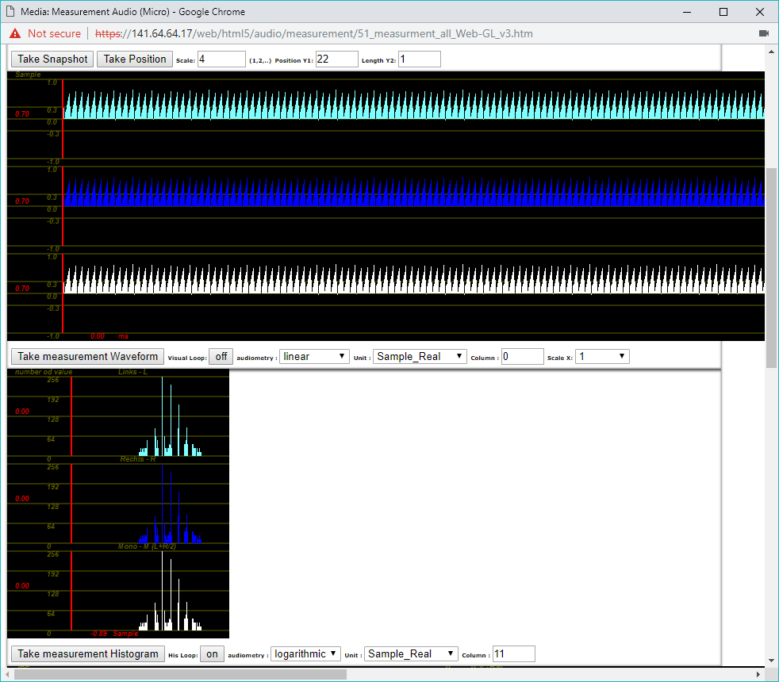

 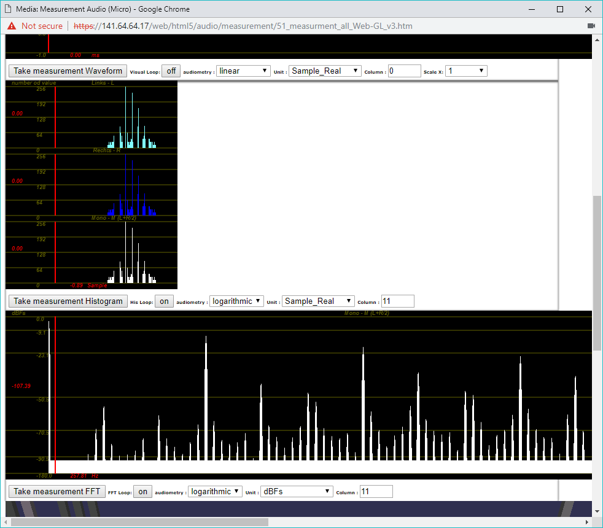

 

# Audio 3.6 FFT
### b) höchste Quantisierung bei bester Wahrnehmungs-Qualität

ca 66000

### c) Wortbreite bei der optimalen Quantisierung

TP 24-16bit = 8 Bit

HP = 0 bit

### d) Datenrate bei 48kHz
1000 Koeffizienten * 2 (real & imaginär) * 3 Blöcke * 1 * 8 Bit

= 48.000

### e) Kompression

2000 * 8 Bit 

1 : 16

### f) Measurement

