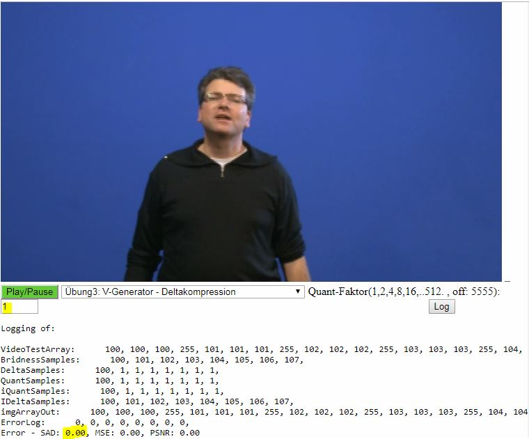
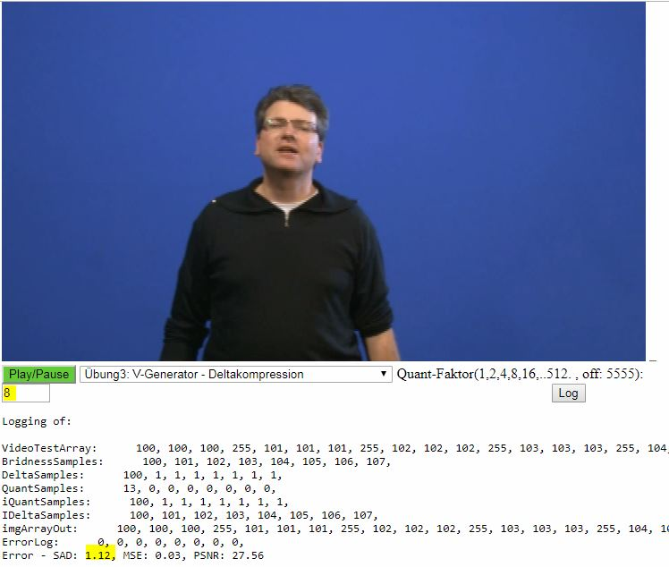
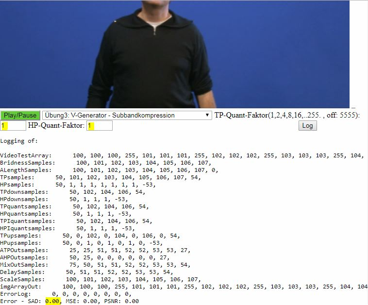

<!-- $size: a4 -portrait -->

# Video 3.1 DeltaKompression
### d)

  i. Fehler bei Quantisierung von 1

Der Fehler bei einer Quantisierung mit Faktor 1 beträgt 0.

---

# Video 3.1 DeltaKompression
### d)

  ii. Fehler bei Quantisierung von 8

Der Fehler bei einer Quantisierung mit Faktor 8 beträgt 1.12.

---

# Video 3.2 SubbandKompression
### c)
  i. Fehler bei Quantisierung von 1

Der Fehler bei einer Quantisierung mit Faktor 1 für HP und TP beträgt 0

---

# Video 3.2 SubbandKompression
### c)

  ii. Fehler bei Quantisierung von 8

Der Fehler bei einer Quantisierung mit Faktor 1 für HP und TP beträgt 2.80

---

# Video 3.3 FFT
### c)
  i. Fehler bei Quantisierung von TP: 1 HP: 1 Grenzwert: 2

Der Fehler bei den Werten TP=1, HP=1 und Grenzfrequenc=2 beträgt 0;

---

# Video 3.3 FFT
### c)

  ii. Fehler bei Quantisierung von TP: 16 HP: 32 Grenzwert: 1

Der Fehler bei den Werten TP=1, HP=1 und Grenzfrequenc=2 beträgt 8.00;

---

# Video 3.4 Delta
### b) höchste Quantisierung bei bester Wahrnehmungs-Qualität

  
Das Bild ist bis zu einem Quantisierungsfaktor von 7 noch sehr gut erkennbar und weist keine wahrnehmbaren Fehler auf.

---

# Video 3.4 Delta
### c) Wortbreite bei der optimalen Quantisierung

  

  Alte Wortbreite: 8
  
  bei einer Quantisierung von 2^W beträgt W = 2.8~
  
  Die Wortbreite der Kompression bei bester Wahrnehmungs-Qualität beträgt demnach 
  
  8 - log(7) / log(2) = 5.2~, also mindestens 6 Bit zur Speicherung

  
---

# Video 3.4 Delta
### d) Datenrate bei 404p25 für RGB

  Unkomprimierte Datenrate:

  25 FPS, 720 * 404 Pixel, Drei Pixel bei RGB mit jeweils 8 Bit für Wertebereich 0-255
  25 * 720 * 404 * 3 * 8 = 174528000 bit/s = 170437,5 kBit/s = 166,44287109375 MBit/s

### e) Kompression

  Runden mit Quantisierungsfaktor 6

  Komprimierte Datenrate (wort längen reduktion) bei quant. Fakt. 7:
  
  25 FPS, 720 * 404 Pixel, Drei Pixel bei RGB mit jeweils 6 Bit für Wertebereich 0-255
  25 * 720 * 404 * 3 * 6 = 130896000 bit/s = 127828,125 kBit/s = 124,8321533203125 MBit/s
  
  Die Datenrate wurde demnach von ca. 166 MBit/s auf ca 124MBit/s komprimiert.
  Das entspricht in etwa einer Kompression von 25%.
  
---

# Video 3.4 Delta
### f) Measurement

;

---

# Video 3.5 Subband
### b) höchste Quantisierung bei bester Wahrnehmungs-Qualität

1500

### c) Wortbreite bei der optimalen Quantisierung

16 bit

---

# Video 3.5 Subband
### d) Datenrate bei 404p25 für RGB

  Unkomprimierte Datenrate:

  25 FPS, 720 * 404 Pixel, Drei Pixel bei RGB mit jeweils 8 Bit für Wertebereich 0-255
  25 * 720 * 404 * 3 * 8 = 174528000 bit/s = 170437,5 kBit/s = 166,44287109375 MBit/s

### e) Kompression

  Runden mit Quantisierungsfaktor TP: 256 und HP: 512
  
  25 FPS, 720 * 404 Pixel, Drei Pixel bei RGB mit jeweils 4 Bit HP und TP
  25 * 720 * 404 * 3 * 4 = 87264000 bit/s = 85218,75 kBit/s = 83,221435546875 MBit/s
  
  Die Datenrate wurde demnach von ca. 166 MBit/s auf ca 83MBit/s komprimiert.
  Das entspricht in etwa einer Kompression von 50%.

### f) Measurement
;

---

# Video 3.6 FFT
### b) höchste Quantisierung bei bester Wahrnehmungs-Qualität

ca 66000

### c) Wortbreite bei der optimalen Quantisierung

TP 24-16bit = 8 Bit

HP = 0 bit

### d) Datenrate bei 404p25 für RGB

(2020Koef)2 (TP) + 0Bit (HP)

25 Frames * 800 * 24 Blöcke * 3 * 14 Bit = 20.160.000 Bit/s = 2.52 MBit/s

### e) Kompression

14 Bit * 800 = 11200

131072/11200

1 : 12

---
# Video 3.6 FFT
### f) Measurement

---

# 3.7 Aufzeichnung eines Medienbeitrags

---

# 3.8 Formate und Distribution - Archive-Format des Beitrags

---

# 3.9 Formate und Distribution - Mobile-Format eines Beitrags

---

# Zusatzaufgabe Veröffntlichen Web-TV

