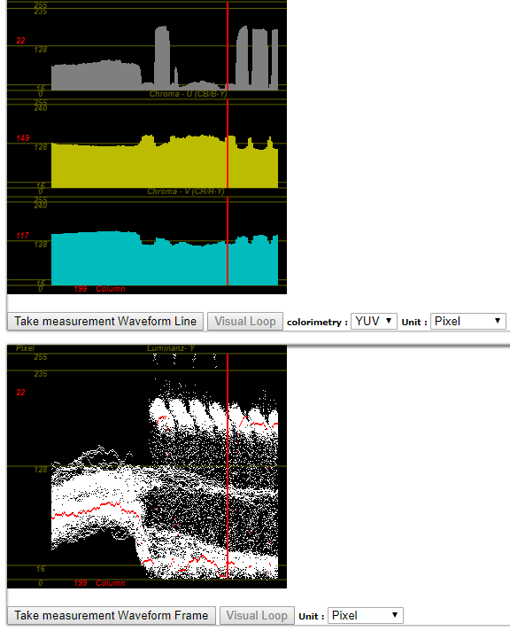

<!-- $size: a4 -portrait -->

#3.8 Formate und Distribution Archive-Format
### a)

Originalldatei

Original Metadaten

### b)

Original Auswertungen

---

#3.9 Formate und Distribution Mobile-Format
### a)

Datei komprimiert

Website Metadaten

### b)

komprimierte Auswertungen

glattere Kanten in der Waveform in Video und Audio

---

#3.9 Zusatz
### a)

web-tv ready komprimiert

Youtube Metadaten

### b)

komprimierte Auswertungen

glattere Kanten in der Waveform in Video und Audio

