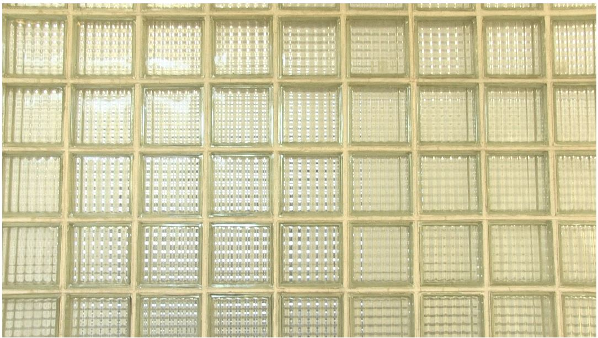

<!-- $size: A4 -portrait -->
> 

  <h1>2.1 a) i. Formel zur Beschreibung des Cosinus</h1>
    
  
  
t, Augenblicksamplitude

  
f, Frequenz

  
T, Periodendauer

  
A* , Maximalwert der Amplitude

  
φ , Phasenverschiebung

---

  <h1>2.1 a) iii. Cosinus Filmgenerator 1Hz</h1>
  
    
  <h1>2.1 a) iii. Cosinus Filmgenerator 1Hz</h1>
   
  
Die Cosinus Schwingung ist im Y Verlauf gut zu erkennen

  
Auch die Waveform zeigt den Farbverlauf sehr gut.

---

  <h1>2.1 b) iii. Cosinus 0Hz</h1>
  
  
0 Hz werden nicht dargestellt.

  <h1>2.1 b) iii. Cosinus 2Hz</h1>
  
  
Wie erwartet ist der Cosinus-Verlauf genau zwei Mal erkennbar bei einer Periodendauer von T=2, also einer Frequenz f=2Hz

---

  <h1>2.1 b) iii. Cosinus 4Hz</h1>
  
  
Wie erwartet ist der Cosinus-Verlauf genau vier Mal erkennbar bei einer Periodendauer von T=4, also einer Frequenz f=4Hz

  <h1>2.1 b 1. Zusatz Cosinus 400Hz</h1>
  
    
Wie erwartet ist der Cosinus-Verlauf bei einer Frequenz von f=400Hz durch Aliasing-Effekte nicht richtig darstellbar.
       Die Verwendete Sampling-Rate beträgt nur 360Hz und die darzustellende Frequenz liegt ca. 41 Hz über dem korrekt darstellbarem Frequenzbereich.
       Die 40 bzw. 41 Hz werden somit "gespiegelt" und entsprechen der dargestellten Frequenz von 320Hz, wie im nachfolgendem Beispiel zu sehen ist.

---

  <h1>2.1 b 1. Zusatz Cosinus 320Hz</h1>
  
      
Die dargestellte Frequen von 320Hz entspricht dem vorangegangenenen Aliasing Beispiel von 400Hz, allerdings hier ohne eine "Spiegelung".

  <h1>2.1 b 1. Zusatz Cosinus 360Hz</h1>
  
  
Die dargestellte Frequen von 360Hz entspricht genau der noch darstellbaren Samplingrate von 720/2

---

  <h1>2.1 b 1. Zusatz Cosinus 720Hz</h1>
  
  
Die dargestellte Frequen von 720Hz entspricht genau der Samplingrate. Daudruch sind die Abtastwerte nicht darstellbar und es entsteht kein Bild bzw.       
     erkennbarer Frequenzgang.

  <h1>2.1 b 1. Zusatz Cosinus 721Hz</h1>
  
    
Die dargestellte Frequen von 721Hz liegt genau 1Hz über der Samplingrate. Durch Aliasing-Effekte 
       entsteht ein Bild des Frequenzgangs von 1Hz.

---

  <h1>2.1 b 1. Zusatz Cosinus 361Hz</h1>
  
  <h1>2.1 b 1. Zusatz Cosinus 359Hz</h1>
  
    
Der Frequenzgang von 359 Hz und 361Hz ist identisch, da die "zu hohe" Frequenz von 361 genau um 1Hz spiegelt und somit die Signatur von 359Hz abbildet.

---

  <h1>2.1 b 2. Bandbegrenzung</h1>
  
Bei geeigneter Bandbegrenzung würden nur die gewünschten Frequenzen dargestellt werden. Aliasing wäre damit nicht mehr möglich. Bei einer Abtastrate von 720 Hz könnte beispielsweise eine maximale Frequenz von 359 Hz festgelegt werden.

---

  <h1>2.2 Kontrast-Berechnung</h1>
    
  
2.2 a) d) Bei 0 DB wird der Kontrast bzw. die Helligkeit nicht verändert.

  
  
2.2 b) d) Eine Halbierung der Helligkeit wird bei -6db erreicht.

---

  <h1>2.3 Chroma-Keying</h1>
  
  
Der zu ersetzende Farbwert ist RGB(52, 82, 161)

  
  
Durch Chroma-Keying wird der definierte Farbwert mit einer gewissen Toleranz durch Alpha=0 dargestellt (Transparenz). Der Hintergrund wird sichtbar.

---

  <h1>2.4 Weichzeichner / Schärfung</h1>
  
2.4 i. Eigenes Asset - Feines Gitter:

  
  
Die Werte-Abweichungen sind im ersten Beispiel sehr schlecht, wordurch z.B. ein Hochpass-Filter keine guten Ergebnisse erzielen kann. Wir haben uns dazu entschieden ein anderes eigenes Asset für die folgenden Analysen zu verwenden.

  

---

  <h1>2.4 Weichzeichner / Schärfung</h1>  
    
2.4 ii. Weichzeichner Tiefpass 1. Ordnung eindimensional

    
  
2.4 iii. Scharfzeichner - Hochpass 1. Ordnung eindimensional

    

---

  <h1>2.4 Weichzeichner / Schärfung</h1>  
    
2.4 iv. Weichzeichner Gauß Tiefpass 2. Ordnung zweidimensional

    
  
2.4 v. Scharfzeichner Gauß - Hochpass 2. Ordnung zweidimensional

    

---

  <h1>2.4 Weichzeichner / Schärfung</h1>  
  
2.4 vi. Auswertung / Messung - Original

  
  
  
  
Klare Struktur erkennbar. Muster in Spektrum ersichtlich. Frequenzgang ist rechtecking, dem Gitter entsprechend.

  
  
2.4 vi. Auswertung / Messung - Tiefpass 1. Ordnung eindimensional (Weichzeichner)

  
  
  
  
Struktur durch langsamere Übergaenge gekenntzeichnet. Steigung und Abfall der Grau-Werte nicht mehr so steil.Muster in Spektrum aber noch immer   
     ersichtlich.

  
  
2.4 vi. Auswertung / Messung - Hochpass 1. Ordnung eindimensional (Scharfzeichner)

  
  
    
  
Durch die Darstellung der "Differenzierung" sind im Frequenzgang nur Starke Differenzen erkennbar. Im Spektrum lässt sich die Struktur aber dennoch 
     erkennen.

---

  <h1>2.4 Weichzeichner / Schärfung</h1>    
  
2.4 vi. Auswertung / Messung - Tiefpass 2. Ordnung zweidimensional (Gauß'scher Weichzeichner)

  
  
  
  
Struktur durch langsamere Übergaenge gekenntzeichnet. Steigung und Abfall der Grau-Werte nicht mehr so steil.Muster in Spektrum aber noch immer   
     ersichtlich.

  
  
2.4 vi. Auswertung / Messung - Hochpass 2. Ordnung zweidimensional (Gauß'scher Scharfzeichner)

  
  
    
  
Konturen und Linien sind sehr viel klarer voneinander abgehoben. Abfall und Steigung zwischen den Linien ist steiler als im Original bzw. dem Weichzeichner. 
     Muster in Spektrum aber noch immer ersichtlich. Fragmente sind ebenfalls stärker hervorgehoben.

---

  <h1>2.5 Soebel-Filter</h1>  
  
2.5 1. Soebelfilter in Webanwendung:

  
  
2.5 2. Soebelfilter Auswertung / Messung:

  
  
   
  
Der Soebel-Filter hat die Konturen korrekt herausgearbeitet. Die Struktur des Gitters ist sehr gut erkennbar. Der Frequenzgang zeichnet sich durch sehr 
     steile Grau-Wert-Abfälle bzw. Steigungen aus. Dies ist durch den hohen Kontrast bzw. wertebedingten Unterschiede zu erklären.

---

  <h1>1.9a Wahrnehmung von Videosignalen (Variation der Deckkraft)</h1>  
  
Originalsignal (Deckkraft des Testvideos: 0%):

  
  
Testsignal (Deckkraft des Testvideos: 100%):

  
  
i. & ii. untere Wahrnehmungsschwelle:

  
  
Die untere Wahrnehmungsschwelle liegt in diesem Beispiel bei ca 10%. Zu sehen an dem unteren angehobenen schwarzen Bereich in der Waveformdarstellung.

  
iii. Dynamik der Störung:

  
10 Prozent von 255 Pixel Systemgrenze = 25 Pixel.  
  Formel: 20 * lg(Uein/Usys) | bei der Dynamik wird mit der Vollaussteuerung von 236 Pixeln gerechnet 
  db der Dynamik der Störung: 20* lg (25/236) = <b>-19,49db</b>

  
iv. & v. obere Wahrnehmungsschwelle:

  
  
Die obere Wahrnehmungsschwelle liegt in diesem Beispiel bei ca 60%. Zu sehen an dem oberen Originalsignal in der Waveformdarstellung.

  
vi. Dynamik des Objekts:

  
60 Prozent von 255 Pixel Systemgrenze = 153 Pixel.  
  Formel: 20 * lg(Uein/Usys) | bei der Dynamik wird mit der Vollaussteuerung von 236 Pixeln gerechnet 
  db der Dynamik des Objekts: 20* lg (153/236) = <b>-3,098db</b>

---

  <h1>1.9b Wahrnehmung von Videosignalen (Variation der Spieldauer)</h1>  
  
Originalsignal:

  
  
Testsignal:

  
  
i. & ii. untere Wahrnehmungsschwelle:

  
  
Die untere Wahrnehmungsschwelle liegt in diesem Beispiel bei ca 30ms.

 
  
iv. & v. obere Wahrnehmungsschwelle:

  
  
Die obere Wahrnehmungsschwelle liegt in diesem Beispiel bei ca 500ms.

