# Aufgabe 1 - Video

## Aufgabe 1.2

### Luminanz Wert Vergleich

Im YUV Farbraum werden digitale Farben in Werten wiedergegeben, die dem unseres Menschlichen Auges ähneln. Durch Analysen von Testbildern fanden wir einige interessante Aspekte die ich hier gerne zur Schau stellen möchte.

Es stellte sich heraus, dass Blau RGB(0, 0, 255) mit einem Luminanzwert von Y-85 dunkler wahrgenommen wird,

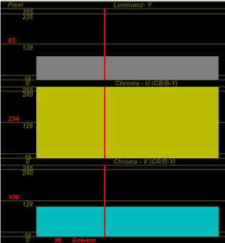{ height=200px }

als Rot RGB(255, 0, 0) mit einem Luminanzwert von Y-138. 

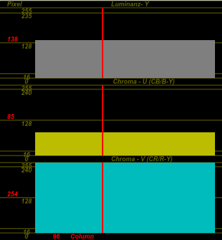{ height=200px }

\pagebreak

Bei Schwarz RGB(16, 16, 16) haben wir den geringsten Helligkeitswert festgestellt, mit einem Luminanzwert von Y-16 - dem Minimalwert.

{ height=200px }

Bei Weiß RGB(235, 235, 235) den höchsten Luminanzwert mit Y-235 - dem Maximalwert. 

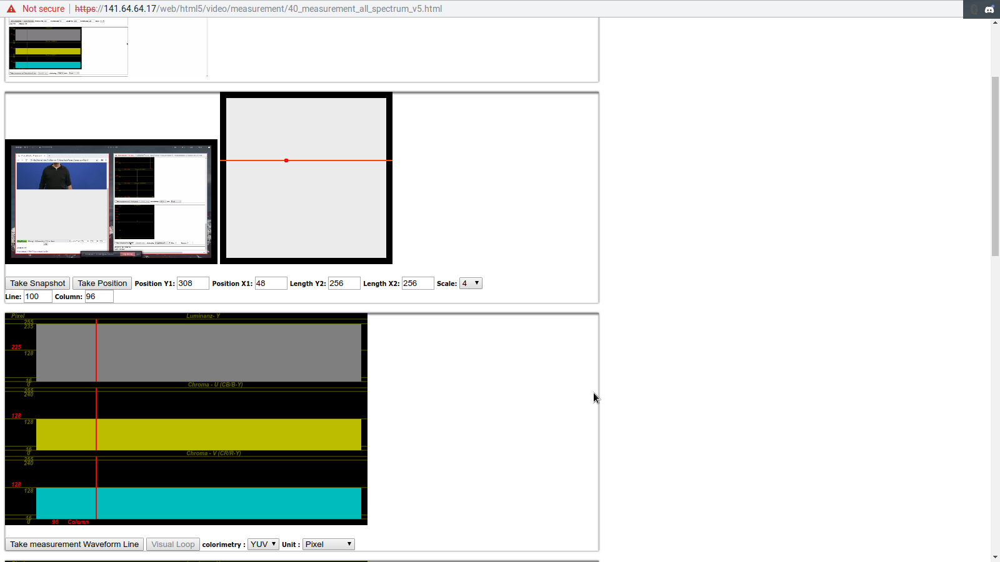{ height=200px }

### Farbwert Vergleich

Schwarz, Grau und Weiß sind frei von jeglichen Farbwerten, daher ist der Farbverschub bei U-128/V-128, dem Mittelwert (Siehe S2, Bild 1 & 2). Jedoch sind die Farbverschübe bei Rot und Blau wie zu erwarten sehr verschieden. Der Farbwert von Rot beträgt YUV(135, 85, 254) (Siehe S2, Bild 1 & 2) wobei Blau einen Farbwert von YUV(85, 254, 108) beträgt.

\pagebreak

## Aufgabe 1.3

### Vergleich zwischen generierten und gefilmten Testbildern

Die vom Bildschirm abgefilmten Testbilder weichen definitiv stark von den generierten Testbildern ab. Die gefilmten Testbilder sind an den Ränder abgedunkelt, weil der gefilmte Bildschirm einen eingeschränkten Blickwinkel hat. Dies lässt sich gut an der gekrümmten Luminanz Kurve erkennen.

\ 

{ height=170px }
{ height=170px }

\ 

Anhand der Luminanzkurve kann man außerdem erkennen, dass in den gefilmten Bildsignalen durch die Aufnahme einiges an Rauschen entstand. 
Erkennbar ist dies an der Körnung der Luminanzkurve. Die Verformung in dieser lässt auf ein schlechteres Bild als das generierte schließen.

Gerade beim roten und blauen Testbild kann man beobachten dass der Bildschirm die Farben nicht originalgeträu wiedergibt.
Im abgefilmten Bild sind deutlich mehr Fremdfarben zu erkennen (zb. Rot RGB[255, 000, 000] sollte nur Rot enthalten).
Erkennbar macht dies der gemessene U- und V-Wert des gefilmten Weißbildes. 
Diese sind nämlich höher als 128 (Pures, farbloses Weiß) und das Bild besitzt damit einen leichten Farbstich.

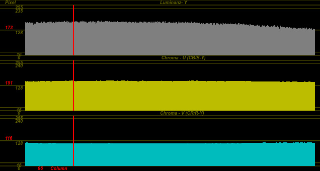{ height=170px }

Leider habe ich den Weißabgleich vor der Bildschirmaufnahme falsch verwendet, deshalb ist der Luminanz-Wert bei Y-173 (Beim weißen Testbild) statt bei den gewünschten Y-235.

\pagebreak

### Vergleich der generierten Testbilder mit den vom Bildschirm abfotografierten

Die abfotografierten Testbilder unterscheiden sich stark von den generierten Testbildern.
Gründe dafür sind unter anderem Verfärbungen des Monitors (die durch einen Weißabgleich jedoch verbessert werden könnten), Verschmutzung des Panels (Staub, Fingerabdrücke, ...), geringer Blickwinkel und vor allem die schlechte Wiedergabe des Farbraums. 
Farben erscheinen auf dem Monitor weniger Kontrastreich und mit weniger Sättigung als generierte Bilder.

Hier nochmal als direkt Vergleich:

{ height=170px }
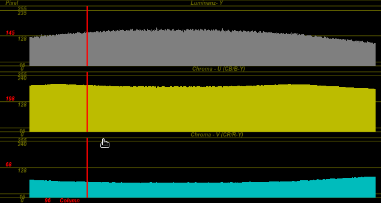{ height=170px }

{ height=170px }
{ height=170px }

Je weniger Kurven / Zacken sich im YUV Diagramm befinden, desto besser ist die Signalqualität / die Qualität des Bildes.

\pagebreak

## Aufgabe 1.4

### Luminanz Vergleich zwischen verschiedenen Gittergrößen

Aufgenommen wurde ein grobemaschiges Abflussgitter und ein gläsernes, feinmaschiges Gitter. Beide Aufnahme wiesen bei der Analyse interessante Daten auf.
Man kann bei der Luminanz Wert Kurve (Y-Wert im YUV Diagramm) erkennen, dass sich eine "Welle" bildet. 

Links: Foto eines grobmaschigen Gitters

Mitte: Luminanz Streuungsdiagramm

Rechts: YUV Streuungsdiagramm

\ 

{ height=170px }
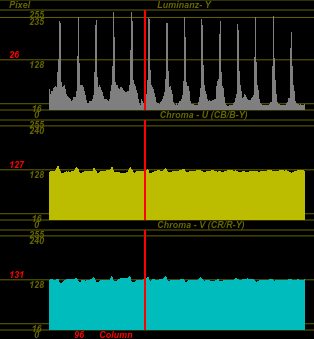{ height=170px }
{ height=170px }

\ 

An den Stellen im Bild, wo Metallverbindungen zu sehen sind, ist das Bild heller (Y-235). Bei den Löchern / dunkleren Stellen ist der Wert geringer (Y-16). 
Beim Bild des groben Gitters, ist zu erkennen, dass diese Helligkeitswelle eine größere "Wellenlänge" besitzt.
Das Bild der gleichmäßig weißen fläche hat keine solche Luminanzwelle.

Feinmaschige Gitter stellen sich ähnlich dar, jedoch mit einer kleineren "Wellenlänge".

\ 

{ height=150px }
{ height=150px }
{ height=150px }

\ 

Links: Foto einer weißen Wand

Mitte: Luminanz Streuungsdiagramm

Rechts: YUV Streuungsdiagramm

\ 

{ height=150px }
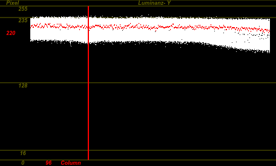{ height=150px }
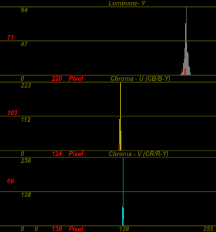{ height=150px }

\ 

Der Luminanzwert ist durchgängig bei 235. Außerdem ist die Luminanzstreuung geringer. Im rechten Bild kann man gut erkennen, dass die Werte kaum vom Höhepunkt abweichen; was auf ein gleichmäßig helles und farbiges Bild schließen lässt.

\pagebreak

### Fenster und ihre Eigenschaften beim Filmen

Das Filmen von Fenstern erwies sich als erstaunlich schwierig, da es innerhalb eines Gebäudes wesentlich dunkler ist als draußen. 
Die richtige Blendeneinstellung zu finden war fast unmöglich. 
Um ein optimales Bild zu erzeugen müsste man entweder den Innenraum stark ausleuchten oder im Postprocessing den Luminanzraum mithilfe von HDR verringern.
Gut zu erkennen ist dieses Phenomen hier:

{ height=150px }

Es lässt sich erahnen, dass der Helligkeitswert der Wände links und rechts zu niedrig sind für ein ausgeglichenes Bild. Dies spiegelt sich wiederum in der Luminanzkurve wieder.

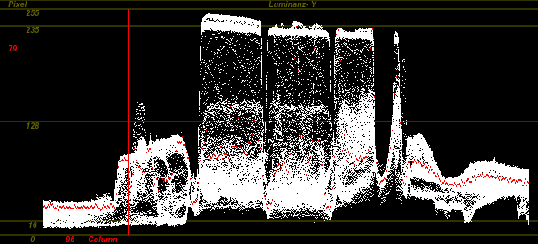{ height=150px }

Wie zu erwarten kann man man links und rechts auf dem Graphen Werte von unter Y-32 ablesen. Dies bestätigt meine Annahme.

\pagebreak

Bei Fenstern die von außen fotografiert werden kann man das genaue Gegenteil beobachten. Dort sind nämlich die Außenwände (besonders bei Sonnenbestrahlung) heller als der Raum hinter dem Fenster.

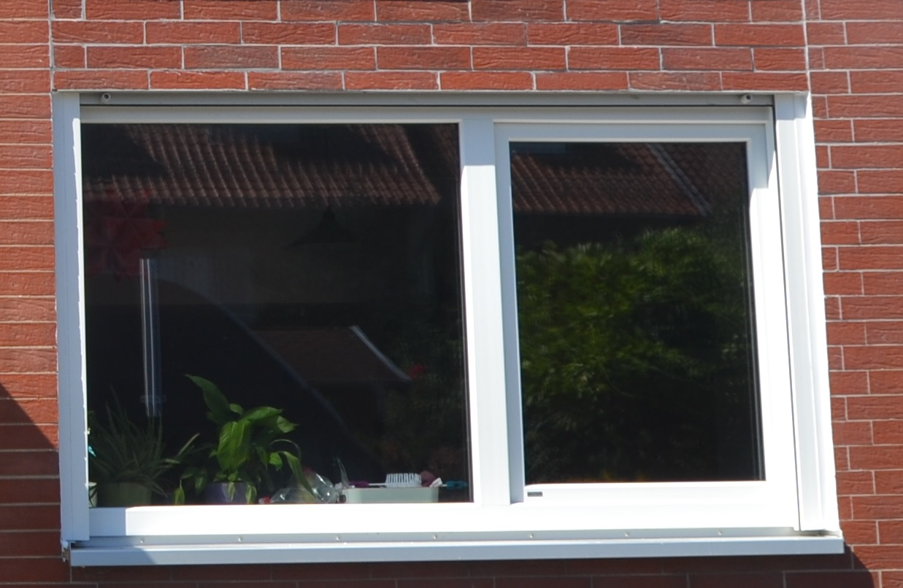{ height=150px }

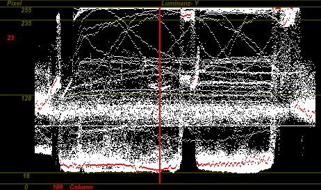{ height=150px }

Man kann gut erkennen wie der weiße Fensterrahmen sich in der Kurve vom Rest abhebt.
Die eigentlichen Fenster sind so dunkel, dass man den Innenraum gar nicht mehr erkennen kann. 

\pagebreak

#### Andere Erkenntnisse

Dadurch, dass nur graue bis weiße Elemente sich im Bild befinden, ist der Farbwert durchgängig etwa mittig (U-127).
Beim langen Gang ist jedoch etwas mehr Luminanzstreuung und Farbstreuung zu sehen, weil sich dunklere und teilweise farbige Gegenstände im Gang befinden.

Fotografie in solchen Gängen ist ebenfalls, wie beim Fenster, schwierig.
Die Deckenlampen in diesem Gang sind wesentlich heller als alles andere in der Komposition. 
Ich versuchte einen Mittelwert zwischen der Helligkeit der Lampen und dem Rest des Ganges zu finden.

{ height=130px }

{ height=130px }

{ height=130px }

Im mittleren Bild sieht man wie zum Beispiel das blaue Treppenschild oben rechts direkt einen Einschlag im Farbstreuungsdiagramm hervorruft. Der weiße Graph schlägt stark in richtung Farbe des Schildes aus.

\pagebreak

## Aufgabe 1.5

### 
